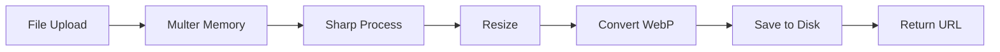

# Backend Documentation - Sistem Manajemen Kos

Dokumentasi teknis untuk backend API menggunakan Express.js, Prisma ORM, dan PostgreSQL.

## Struktur Direktori

```
backend/
├── prisma/
│   ├── schema.prisma       # Database schema
│   ├── migrations/         # Migration files
│   └── seed.js             # Seed data
├── src/
│   ├── app.js              # Express app setup
│   ├── config/             # Configurations
│   │   ├── database.js     # Prisma client
│   │   └── multer.config.js # File upload config
│   ├── controllers/        # Request handlers
│   ├── services/           # Business logic
│   ├── middlewares/        # Custom middlewares
│   ├── routes/             # Route definitions
│   ├── models/             # Prisma client export
│   ├── utils/              # Utility functions
│   └── validations/        # Input validation
├── uploads/                # Uploaded files
├── logs/                   # Log files
├── Dockerfile              # Docker config
├── server.js               # Entry point
└── package.json
```

## Quick Start

### Development

```bash
# Install dependencies
npm install

# Generate Prisma Client
npm run prisma:generate

# Run migrations
npm run prisma:migrate

# Seed database
npm run prisma:seed

# Start development server
npm run dev
```

### npm Scripts

| Script | Deskripsi |
|--------|-----------|
| `npm start` | Start production server |
| `npm run dev` | Start with nodemon (hot reload) |
| `npm run prisma:generate` | Generate Prisma Client |
| `npm run prisma:migrate` | Run database migrations |
| `npm run prisma:push` | Push schema to DB (dev) |
| `npm run prisma:studio` | Open Prisma Studio |
| `npm run prisma:seed` | Seed database |

## Database Schema

### Models Overview

| Model | Tabel | Deskripsi |
|-------|-------|-----------|
| `User` | `users` | User accounts (Pemilik/Penghuni) |
| `KategoriKamar` | `kategori_kamar` | Room categories |
| `Kamar` | `kamar` | Room data |
| `FasilitasKamar` | `fasilitas_kamar` | Room facilities |
| `FotoKamar` | `foto_kamar` | Room photos |
| `RiwayatSewa` | `riwayat_sewa` | Rental history |
| `Tagihan` | `tagihan` | Invoices |
| `Payment` | `payment` | Payment records |
| `KategoriBarang` | `kategori_barang` | Item categories |
| `NamaBarang` | `nama_barang` | Item names |
| `Barang` | `barang` | Items |
| `InventoriKamar` | `inventori_kamar` | Room inventory |
| `Laporan` | `laporan` | Damage reports |

### Enum Types

```prisma
enum Role {
  PEMILIK   // Admin/Owner
  PENGHUNI  // Tenant
}

enum StatusKamar {
  TERSEDIA   // Available
  TERISI     // Occupied
  PERBAIKAN  // Under maintenance
}

enum StatusSewa {
  AKTIF      // Active rental
  SELESAI    // Completed
  DIBATALKAN // Cancelled
}

enum StatusTagihan {
  BELUM_LUNAS // Unpaid
  LUNAS       // Paid
  JATUH_TEMPO // Overdue
}

enum StatusPayment {
  PENDING  // Waiting
  SUCCESS  // Completed
  FAILED   // Failed
  EXPIRED  // Expired
  CANCEL   // Cancelled
}

enum Prioritas {
  RENDAH  // Low
  NORMAL  // Normal
  TINGGI  // High
  URGENT  // Urgent
}

enum StatusLaporan {
  DIAJUKAN  // Submitted
  DIPROSES  // In progress
  SELESAI   // Completed
  DITOLAK   // Rejected
}
```

## API Routes

### Route Index (`/api`)

```javascript
router.use('/auth', authRoutes);     // Authentication
router.use('/users', userRoutes);    // User management
router.use('/kamar', kamarRoutes);   // Room management
router.use('/barang', barangRoutes); // Item management
router.use('/tagihan', tagihanRoutes); // Invoice management
router.use('/payment', paymentRoutes); // Payment processing
router.use('/laporan', laporanRoutes); // Report management
```

### Authentication Routes (`/api/auth`)

| Method | Endpoint | Deskripsi | Auth |
|--------|----------|-----------|:----:|
| POST | `/register` | Register new user | yes |
| POST | `/login` | User login | no |
| GET | `/me` | Get current user | yes |
| GET | `/verify-email/:token` | Verify email | no |
| POST | `/resend-verification` | Resend verification email | no |
| POST | `/forgot-password` | Request password reset | no |
| POST | `/reset-password` | Reset password | no |
| POST | `/logout` | Logout (blacklist token) | yes |

### User Routes (`/api/users`)

| Method | Endpoint | Deskripsi | Auth | Role |
|--------|----------|-----------|:----:|------|
| GET | `/` | List all users | yes | Pemilik |
| GET | `/:id` | Get user by ID | yes | All |
| PUT | `/:id` | Update user | yes | All |
| DELETE | `/:id` | Delete user | yes | Pemilik |
| PUT | `/:id/foto` | Upload profile photo | yes | All |
| GET | `/penghuni` | List penghuni only | yes | Pemilik |

### Room Routes (`/api/kamar`)

| Method | Endpoint | Deskripsi | Auth | Role |
|--------|----------|-----------|:----:|------|
| GET | `/` | List all rooms | yes | All |
| GET | `/public` | List available rooms (public) | no | - |
| GET | `/:id` | Get room detail | yes | All |
| POST | `/` | Create room | yes | Pemilik |
| PUT | `/:id` | Update room | yes | Pemilik |
| DELETE | `/:id` | Delete room | yes | Pemilik |
| POST | `/:id/photos` | Upload room photos | yes | Pemilik |
| DELETE | `/:id/photos/:photoId` | Delete photo | yes | Pemilik |
| GET | `/kategori` | List categories | yes | All |
| POST | `/kategori` | Create category | yes | Pemilik |

### Item Routes (`/api/barang`)

| Method | Endpoint | Deskripsi | Auth |
|--------|----------|-----------|:----:|
| GET | `/kategori` | List item categories | yes |
| POST | `/kategori` | Create category | yes |
| GET | `/nama` | List item names | yes |
| POST | `/nama` | Create item name | yes |
| GET | `/` | List all items | yes |
| POST | `/` | Create item | yes |
| GET | `/inventori` | List room inventory | yes |
| POST | `/inventori` | Add to inventory | yes |
| PUT | `/inventori/:id` | Update inventory | yes |
| DELETE | `/inventori/:id` | Delete from inventory | yes |

### Invoice Routes (`/api/tagihan`)

| Method | Endpoint | Deskripsi | Auth | Role |
|--------|----------|-----------|:----:|------|
| GET | `/` | List invoices | yes | All |
| GET | `/:id` | Get invoice detail | yes | All |
| POST | `/generate` | Generate monthly invoices | yes | Pemilik |
| PUT | `/:id` | Update invoice | yes | Pemilik |
| DELETE | `/:id` | Delete invoice | yes | Pemilik |

### Payment Routes (`/api/payment`)

| Method | Endpoint | Deskripsi | Auth |
|--------|----------|-----------|:----:|
| GET | `/` | List payments | yes |
| POST | `/` | Create payment (Midtrans) | yes |
| POST | `/notification` | Midtrans webhook | no |
| GET | `/:id` | Get payment detail | yes |

### Report Routes (`/api/laporan`)

| Method | Endpoint | Deskripsi | Auth | Role |
|--------|----------|-----------|:----:|------|
| GET | `/` | List reports | yes | All |
| GET | `/:id` | Get report detail | yes | All |
| POST | `/` | Create report | yes | Penghuni |
| PATCH | `/:id/status` | Update status | yes | Pemilik |
| DELETE | `/:id` | Delete report | yes | Pemilik |

## Controllers

### Controller Pattern

```javascript
// Pattern: Thin controller, fat service
const controllerName = async (req, res, next) => {
  try {
    // 1. Extract data from request
    const { body, params, query, user } = req;
    
    // 2. Call service method
    const result = await service.method(data);
    
    // 3. Return response
    res.status(statusCode).json({
      success: true,
      message: 'Success message',
      data: result
    });
  } catch (error) {
    next(error); // Pass to error handler
  }
};
```

### Available Controllers

| File | Fungsi |
|------|--------|
| `auth.controller.js` | Login, register, verify email, password reset |
| `user.controller.js` | CRUD users, profile management |
| `kamar.controller.js` | CRUD rooms, photos, categories |
| `barang.controller.js` | CRUD items, categories, inventory |
| `tagihan.controller.js` | CRUD invoices, generate bulk |
| `payment.controller.js` | Create payment, handle webhook |
| `laporan.controller.js` | CRUD damage reports |

## Services

### Service Pattern

```javascript
// Pattern: Business logic encapsulation
class ServiceName {
  async method(params) {
    // 1. Validate business rules
    // 2. Perform database operations
    // 3. Handle external integrations
    // 4. Return result or throw error
  }
}
```

### Available Services

| File | Deskripsi |
|------|-----------|
| `auth.service.js` | Authentication & authorization logic |
| `user.service.js` | User management operations |
| `kamar.service.js` | Room & rental operations |
| `barang.service.js` | Item & inventory operations |
| `tagihan.service.js` | Invoice generation & management |
| `payment.service.js` | Payment processing (Midtrans) |
| `booking.service.js` | Room booking operations |
| `laporan.service.js` | Damage report operations |

## Middlewares

### Authentication Middleware

```javascript
// middlewares/auth.middleware.js
const authenticate = async (req, res, next) => {
  // 1. Extract token from Authorization header
  // 2. Verify JWT token
  // 3. Check if token is blacklisted
  // 4. Attach user to request
  // 5. Call next() or return 401
};

const authorize = (...roles) => {
  return (req, res, next) => {
    // Check if user role is in allowed roles
  };
};
```

### File Upload Middleware

```javascript
// middlewares/upload.middleware.js
const upload = multer({
  storage: multer.memoryStorage(),
  limits: { fileSize: 5 * 1024 * 1024 }, // 5MB
  fileFilter: (req, file, cb) => {
    // Validate file type (jpg, jpeg, png)
  }
});
```

### Error Handler Middleware

```javascript
// middlewares/errorHandler.middleware.js
const errorHandler = (err, req, res, next) => {
  // 1. Log error
  // 2. Determine status code
  // 3. Return appropriate error response
};
```

### Available Middlewares

| File | Fungsi |
|------|--------|
| `auth.middleware.js` | JWT authentication & role authorization |
| `upload.middleware.js` | Multer file upload configuration |
| `validate.middleware.js` | Request validation using Zod |
| `errorHandler.middleware.js` | Global error handling |

## Authentication

### JWT Token Structure

```json
{
  "id": 1,
  "email": "user@example.com",
  "role": "PEMILIK",
  "iat": 1703318400,
  "exp": 1703923200
}
```

### Token Flow

```
1. Login → Generate JWT → Return to client
2. Client stores token in localStorage
3. Client sends token in Authorization header
4. Server validates token on protected routes
5. Logout → Add token to blacklist
```

### Protected Route Example

```javascript
router.get('/protected',
  authenticate,           // Verify JWT
  authorize('PEMILIK'),   // Check role
  controller.method       // Handle request
);
```

## Image Processing

### Sharp Integration

```javascript
// utils/imageCompressor.js
const compressImage = async (buffer, filename) => {
  const output = await sharp(buffer)
    .resize(1920, 1080, { 
      fit: 'inside',
      withoutEnlargement: true 
    })
    .webp({ quality: 80 })
    .toFile(outputPath);
  
  return newFilename;
};
```

### Upload Flow



## Email Service

### Nodemailer Configuration

```javascript
// utils/email.js
const transporter = nodemailer.createTransport({
  host: process.env.SMTP_HOST,
  port: process.env.SMTP_PORT,
  auth: {
    user: process.env.SMTP_USER,
    pass: process.env.SMTP_PASS
  }
});
```

### Email Templates

| Template | Trigger | Content |
|----------|---------|---------|
| Verification | User registration | Link to verify email |
| Reset Password | Forgot password | Link to reset password |
| Payment Success | Payment completed | Payment confirmation |
| New Laporan | Report created | Notify pemilik |
| Status Update | Status changed | Notify penghuni |

## Payment Integration (Midtrans)

### Flow

```javascript
// 1. Create transaction
const snap = new midtransClient.Snap({
  isProduction: process.env.MIDTRANS_IS_PRODUCTION === 'true',
  serverKey: process.env.MIDTRANS_SERVER_KEY
});

// 2. Create transaction parameters
const parameter = {
  transaction_details: {
    order_id: 'ORDER-123',
    gross_amount: 1000000
  },
  customer_details: {...}
};

// 3. Create snap token
const transaction = await snap.createTransaction(parameter);

// 4. Handle notification webhook
// POST /api/payment/notification
```

### Webhook Handling

```javascript
// Verify signature
const hash = crypto.createHash('sha512')
  .update(orderId + statusCode + grossAmount + serverKey)
  .digest('hex');

if (signatureKey === hash) {
  // Update payment status
}
```

## Validation

### Zod Schema Example

```javascript
// validations/user.validation.js
const registerSchema = z.object({
  name: z.string().min(3).max(255),
  email: z.string().email(),
  password: z.string().min(6),
  phone: z.string().optional(),
  role: z.enum(['PEMILIK', 'PENGHUNI']).optional()
});
```

### Validation Middleware

```javascript
const validate = (schema) => (req, res, next) => {
  const result = schema.safeParse(req.body);
  if (!result.success) {
    return res.status(400).json({
      success: false,
      errors: result.error.errors
    });
  }
  req.body = result.data;
  next();
};
```

## Logging

### Winston Logger

```javascript
// utils/logger.js
const logger = winston.createLogger({
  level: 'info',
  format: winston.format.combine(
    winston.format.timestamp(),
    winston.format.json()
  ),
  transports: [
    new winston.transports.File({ filename: 'logs/error.log', level: 'error' }),
    new winston.transports.File({ filename: 'logs/combined.log' })
  ]
});
```

### Log Levels

| Level | Penggunaan |
|-------|------------|
| `error` | Error yang perlu perhatian |
| `warn` | Warning yang tidak kritis |
| `info` | Informasi operasional |
| `debug` | Detail untuk debugging |

## Error Handling

### Error Response Format

```json
{
  "success": false,
  "message": "Error message",
  "errors": [...] // Optional, for validation errors
}
```

### Common HTTP Status Codes

| Code | Penggunaan |
|------|------------|
| 200 | Success |
| 201 | Created |
| 400 | Bad Request (validation error) |
| 401 | Unauthorized (not logged in) |
| 403 | Forbidden (no permission) |
| 404 | Not Found |
| 409 | Conflict (duplicate data) |
| 500 | Internal Server Error |

## Docker Configuration

### Dockerfile

```dockerfile
FROM node:18-alpine

# Install dependencies for Sharp
RUN apk add --no-cache vips-dev

WORKDIR /app
COPY package*.json ./
RUN npm ci --only=production
COPY . .

RUN npx prisma generate

EXPOSE 5000
CMD ["node", "server.js"]
```

### Environment Variables

| Variable | Deskripsi | Required |
|----------|-----------|:--------:|
| `DATABASE_URL` | PostgreSQL connection string | yes |
| `JWT_SECRET` | JWT signing secret | yes |
| `JWT_EXPIRES_IN` | Token expiration (e.g. "7d") | yes |
| `FRONTEND_URL` | Frontend URL for CORS & emails | yes |
| `MIDTRANS_SERVER_KEY` | Midtrans server key | yes |
| `MIDTRANS_CLIENT_KEY` | Midtrans client key | yes |
| `MIDTRANS_IS_PRODUCTION` | true/false | yes |
| `SMTP_HOST` | Email server host | yes |
| `SMTP_PORT` | Email server port | yes |
| `SMTP_USER` | Email username | yes |
| `SMTP_PASS` | Email password | yes |
| `EMAIL_FROM` | Sender email address | yes |
| `IMAGE_QUALITY` | Image compression quality (1-100) | no |
| `IMAGE_MAX_WIDTH` | Max image width | no |
| `IMAGE_MAX_HEIGHT` | Max image height | no |

## End-to-End Flow Documentation

### Authentication Flow (Login)

Berikut adalah alur lengkap proses login dari request hingga response:

```
Frontend (Login.jsx)
    ↓ user submit form
authStore.login(email, password)
    ↓ call service
authService.login(email, password)
    ↓ axios POST
Backend: POST /api/auth/login
    ↓ route handler
auth.routes.js → auth.controller.login()
    ↓ call service
auth.service.login(email, password)
    ↓
    ├── prisma.user.findUnique({ email })
    ├── bcrypt.compare(password, hash)
    ├── jwt.sign({ userId, role })
    └── prisma.user.update({ token })
    ↓ return
{ user: {...}, token: "jwt..." }
    ↓ controller response
res.json({ success: true, data: result })
    ↓ axios response
authStore.setUser(user), setToken(token)
    ↓ persist
localStorage (zustand persist)
    ↓ navigate
/dashboard
```

### Room Management Flow (Create Room)

```
Frontend (KamarForm.jsx)
    ↓ user submit form with photos
handleSubmit(formData)
    ↓ call service
kamarService.create(data)
    ↓ axios POST (multipart/form-data)
Backend: POST /api/kamar
    ↓ middleware chain
auth.middleware.authenticate()
    ↓ verify JWT token
auth.middleware.authorize('PEMILIK')
    ↓ check role
upload.middleware.array('foto', 10)
    ↓ multer process files
kamar.controller.create()
    ↓ call service
kamar.service.createKamar(data, files)
    ↓
    ├── Validate kategori exists
    ├── prisma.kamar.create({...})
    ├── For each file:
    │   ├── imageCompressor.compress(buffer)
    │   ├── sharp.resize().webp()
    │   └── save to /uploads
    └── prisma.fotoKamar.createMany([...])
    ↓ return
{ kamar data with fotos }
    ↓ controller response
res.status(201).json({ success: true, data })
    ↓ frontend
kamarStore.addKamar(newKamar)
    ↓ navigate
/kamar/:id
```

### Payment Flow (Midtrans Integration)

```
Frontend (TagihanDetail.jsx)
    ↓ user click "Bayar"
handlePayment(tagihanId)
    ↓ call service
paymentService.create({ tagihanId })
    ↓ axios POST
Backend: POST /api/payment
    ↓ middleware
authenticate()
    ↓
payment.controller.createPayment()
    ↓ call service
payment.service.createPayment(userId, tagihanId)
    ↓
    ├── prisma.tagihan.findUnique({ id })
    ├── Validate tagihan belongs to user
    ├── midtrans.Snap.createTransaction({
    │     order_id, gross_amount,
    │     customer_details, item_details
    │   })
    ├── prisma.payment.create({
    │     status: PENDING,
    │     midtransOrderId,
    │     snapToken
    │   })
    └── Return { redirectUrl, snapToken }
    ↓ controller response
res.json({ success: true, data: { redirectUrl } })
    ↓ frontend
window.location.href = redirectUrl (Midtrans page)
    ↓ user completes payment on Midtrans
Midtrans Server → POST /api/payment/notification (webhook)
    ↓
payment.controller.handleNotification()
    ↓ call service
payment.service.handleNotification(notification)
    ↓
    ├── Verify signature (sha512)
    ├── prisma.payment.update({ status: SUCCESS })
    ├── prisma.tagihan.update({ status: LUNAS })
    └── sendPaymentEmail(user.email)
    ↓ Midtrans redirects user
Frontend: /payment/finish?order_id=xxx
    ↓
PaymentFinish.jsx → show success message
```

### Damage Report Flow (Laporan Kerusakan)

```
Frontend (LaporanForm.jsx)
    ↓ penghuni submit form with photo
handleSubmit({ judul, deskripsi, foto })
    ↓ call service (FormData)
laporanService.create(formData)
    ↓ axios POST (multipart)
Backend: POST /api/laporan
    ↓ middleware chain
authenticate() → authorize('PENGHUNI') → upload.single('foto')
    ↓
laporan.controller.create()
    ↓ call service
laporan.service.createLaporan(userId, data, file)
    ↓
    ├── Get user's active rental
    ├── prisma.riwayatSewa.findFirst({ userId, status: AKTIF })
    ├── Compress & save image
    ├── prisma.laporan.create({
    │     userId, kamarId, judul,
    │     deskripsi, foto, status: DIAJUKAN
    │   })
    └── sendLaporanNotification(pemilikEmail)
    ↓ email sent to pemilik
"Ada laporan kerusakan baru dari [penghuni]"
    ↓ controller response
res.status(201).json({ success: true, data })
    ↓ frontend
toast.success("Laporan berhasil dikirim")
    ↓ navigate
/laporan

--- Later: Pemilik updates status ---

Frontend (LaporanDetail.jsx)
    ↓ pemilik click "Update Status"
handleUpdateStatus(id, { status: 'SELESAI', catatan })
    ↓ call service
laporanService.updateStatus(id, data)
    ↓ axios PATCH
Backend: PATCH /api/laporan/:id/status
    ↓ middleware
authenticate() → authorize('PEMILIK')
    ↓
laporan.controller.updateStatus()
    ↓ call service
laporan.service.updateStatus(id, status, catatan)
    ↓
    ├── prisma.laporan.update({ status, catatan })
    └── sendStatusUpdateEmail(penghuniEmail)
    ↓ email sent to penghuni
"Laporan Anda telah diproses: [status]"
```

### Invoice Generation Flow (Tagihan)

```
Frontend (TagihanList.jsx)
    ↓ pemilik click "Generate Tagihan Bulanan"
handleGenerate({ bulan, tahun })
    ↓ call service
tagihanService.generate({ bulan, tahun })
    ↓ axios POST
Backend: POST /api/tagihan/generate
    ↓ middleware
authenticate() → authorize('PEMILIK')
    ↓
tagihan.controller.generateBulk()
    ↓ call service
tagihan.service.generateMonthlyTagihan(bulan, tahun)
    ↓
    ├── prisma.riwayatSewa.findMany({ status: AKTIF })
    ├── For each active rental:
    │   ├── Check if tagihan exists for month
    │   ├── Calculate amount from kamar.hargaSewa
    │   ├── Generate nomorTagihan (unique)
    │   └── prisma.tagihan.create({
    │         riwayatSewaId, userId,
    │         periodeBulan, totalTagihan,
    │         jatuhTempo, status: BELUM_LUNAS
    │       })
    └── Return count of created tagihan
    ↓ controller response
res.json({ success: true, message: "5 tagihan berhasil dibuat" })
    ↓ frontend
toast.success() → refetch tagihan list
```

## Module Dependency Diagram

```
src/
├── app.js ─────────────────┐
│   Uses:                   │
│   ├── helmet (security)   │
│   ├── cors (CORS)         │
│   ├── morgan (logging)    │
│   └── routes/index.js ────┼──→ All route modules
│                           │
├── routes/ ────────────────┤
│   └── *.routes.js         │
│       Uses:               │
│       ├── controllers     │
│       ├── middlewares     │
│       └── validations     │
│                           │
├── controllers/ ───────────┤
│   └── *.controller.js     │
│       Uses:               │
│       └── services        │
│                           │
├── services/ ──────────────┤
│   └── *.service.js        │
│       Uses:               │
│       ├── prisma (DB)     │
│       ├── utils/email     │
│       ├── utils/helpers   │
│       └── external APIs   │
│           (Midtrans)      │
│                           │
├── middlewares/ ───────────┤
│   ├── auth.middleware     │
│   │   Uses: jwt, prisma   │
│   ├── upload.middleware   │
│   │   Uses: multer        │
│   └── validate.middleware │
│       Uses: zod           │
│                           │
├── utils/ ─────────────────┤
│   ├── email.js            │
│   │   Uses: nodemailer    │
│   ├── imageCompressor.js  │
│   │   Uses: sharp         │
│   ├── logger.js           │
│   │   Uses: winston       │
│   └── helpers.js          │
│       Uses: crypto        │
│                           │
└── config/ ────────────────┘
    └── database.js
        Uses: @prisma/client
```

## Request Lifecycle

Setiap request HTTP melewati tahapan berikut:

```
1. HTTP Request masuk
       ↓
2. Nginx (reverse proxy, jika production)
       ↓
3. Express App (app.js)
       ↓
4. Global Middlewares:
   ├── helmet() - Security headers
   ├── cors() - CORS handling
   ├── morgan() - Request logging
   ├── express.json() - Parse JSON body
   └── express.static() - Serve /uploads
       ↓
5. Route Matching (/api/*)
       ↓
6. Route-specific Middlewares:
   ├── authenticate() - Verify JWT
   ├── authorize() - Check role
   ├── validate() - Validate input
   └── upload() - Handle files
       ↓
7. Controller
   └── Extract data, call service
       ↓
8. Service
   └── Business logic, DB operations
       ↓
9. Response
   ├── Success: { success: true, data }
   └── Error: errorHandler middleware
       ↓
10. HTTP Response
```

