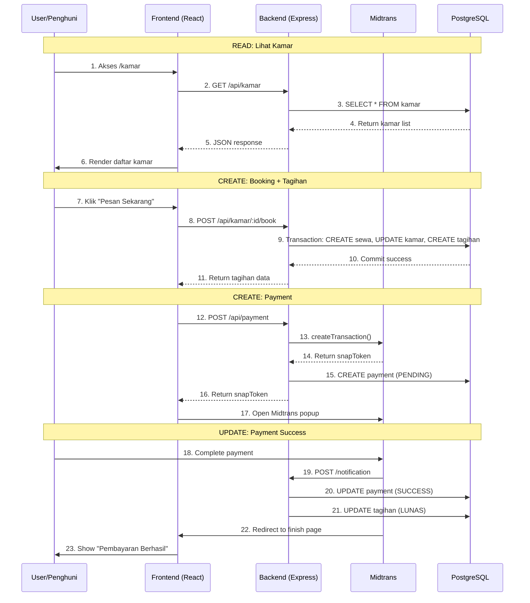

# Fitur Utama CRUD Tagihan dan Pembayaran

Dokumentasi alur MVC (Model-View-Controller) pada fitur CRUD Tagihan dan Pembayaran yang menjelaskan setiap step dalam proses pemesanan, pembayaran, dan pembatalan.

---

## Daftar Isi

1. [Arsitektur MVC dalam Sistem](#arsitektur-mvc-dalam-sistem)
2. [Read: Melihat Daftar Kamar](#1-read-melihat-daftar-kamar)
3. [Read: Melihat Detail Kamar](#2-read-melihat-detail-kamar)
4. [Create: Pemesanan Kamar](#3-create-pemesanan-kamar)
5. [Create: Membuat Tagihan](#4-create-membuat-tagihan)
6. [Create: Membuat Pembayaran](#5-create-membuat-pembayaran)
7. [Read: Melihat Daftar Tagihan](#6-read-melihat-daftar-tagihan)
8. [Read: Melihat Daftar Pembayaran](#7-read-melihat-daftar-pembayaran)
9. [Update & Delete: Pembatalan Pembayaran](#8-update--delete-pembatalan-pembayaran)
10. [Update: Pembayaran Berhasil](#9-update-pembayaran-berhasil)

---

## Arsitektur MVC dalam Sistem

Sistem ini mengimplementasikan arsitektur **MVCS (Model-View-Controller-Service)**:

| Layer | Tanggung Jawab | Lokasi |
|-------|----------------|--------|
| **Model** | Struktur data & relasi database (Prisma ORM) | `backend/prisma/schema.prisma` |
| **View** | Antarmuka pengguna (React.js) | `frontend/src/pages/` |
| **Controller** | Menerima request & mengembalikan response | `backend/src/controllers/` |
| **Service** | Logika bisnis & interaksi dengan database | `backend/src/services/` |
| **Routes** | Definisi endpoint API & middleware | `backend/src/routes/` |

---

## 1. READ: Melihat Daftar Kamar

> **File:** [KamarList.jsx](/frontend/src/pages/kamar/KamarList.jsx)

Ketika penghuni mengakses halaman `/kamar`, sistem menampilkan daftar semua kamar yang tersedia.

### View: Memanggil API

```jsx
// KamarList.jsx
useEffect(() => {
    const fetchKamar = async () => {
        const response = await kamarService.getAll(filters);
        setKamarList(response.data);
    };
    fetchKamar();
}, [filters]);
```

> **File:** [kamar.service.js (Frontend)](/frontend/src/services/kamar.service.js)

```javascript
// kamar.service.js
getAll: async (params = {}) => {
    return api.get('/kamar', { params });
},
```

### Routes: Endpoint Definition

> **File:** [kamar.routes.js](/backend/src/routes/kamar.routes.js)

```javascript
// kamar.routes.js - Public routes
router.get('/', kamarController.getAllKamar);
```

### Controller: Handle Request

> **File:** [kamar.controller.js](/backend/src/controllers/kamar.controller.js)

```javascript
// kamar.controller.js
const getAllKamar = async (req, res, next) => {
    try {
        const result = await kamarService.getAllKamar(req.query);
        return success(res, 'Berhasil mendapatkan daftar kamar', result.kamar, result.meta);
    } catch (error) {
        next(error);
    }
};
```

### Service: Business Logic

> **File:** [kamar.service.js (Backend)](/backend/src/services/kamar.service.js)

```javascript
// kamar.service.js
const getAllKamar = async (query) => {
    const kamar = await prisma.kamar.findMany({
        where: { deletedAt: null, status: 'TERSEDIA' },
        include: { kategori: true, fotoKamar: true },
        orderBy: { createdAt: 'desc' }
    });
    return { kamar };
};
```

### Model: Prisma Schema

> **File:** [schema.prisma](/backend/prisma/schema.prisma)

```prisma
model Kamar {
  id              Int       @id @default(autoincrement())
  namaKamar       String    @unique @map("nama_kamar")
  hargaPerBulan   Decimal?  @map("harga_per_bulan")
  status          StatusKamar @default(TERSEDIA)
  
  kategori        KategoriKamar? @relation(fields: [kategoriId], references: [id])
  fotoKamar       FotoKamar[]
  riwayatSewa     RiwayatSewa[]
  
  @@map("kamar")
}
```

---

## 2. READ: Melihat Detail Kamar

> **File:** [KamarDetail.jsx](/frontend/src/pages/kamar/KamarDetail.jsx)

Ketika penghuni mengklik salah satu kamar, sistem menampilkan detail kamar beserta foto dan fasilitas.

### View: Fetch Detail Kamar

```jsx
// KamarDetail.jsx
useEffect(() => {
    const fetchKamar = async () => {
        const response = await kamarService.getById(id);
        setKamar(response.data);
    };
    fetchKamar();
}, [id]);
```

### Service (Backend): Get By ID

> **File:** [kamar.service.js (Backend)](/backend/src/services/kamar.service.js)

```javascript
// kamar.service.js
const getKamarById = async (id) => {
    const kamar = await prisma.kamar.findUnique({
        where: { id: parseInt(id), deletedAt: null },
        include: {
            kategori: true,
            fotoKamar: { orderBy: { urutan: 'asc' } },
            fasilitasDetail: true,
            riwayatSewa: {
                include: { user: { select: { id: true, name: true, email: true } } }
            }
        }
    });

    if (!kamar) {
        throw { statusCode: 404, message: 'Kamar tidak ditemukan' };
    }

    return kamar;
};
```

**Penjelasan:**
- Prisma melakukan query `SELECT` dengan `JOIN` ke tabel relasi
- Data dikembalikan dalam format JSON ke frontend
- View merender detail kamar beserta foto dan fasilitas

---

## 3. CREATE: Pemesanan Kamar

> **File:** [KamarDetail.jsx](/frontend/src/pages/kamar/KamarDetail.jsx)

Ketika penghuni menekan tombol **"Pesan dan Bayar Sekarang"**:

```jsx
// KamarDetail.jsx
<button onClick={handleBooking} className="btn-primary">
    <HiCreditCard className="w-5 h-5" />
    Pesan dan Bayar Sekarang
</button>
```

### View: Handle Booking

```jsx
// KamarDetail.jsx
const handleBooking = async () => {
    try {
        const response = await bookingService.createBooking(
            kamar.id,
            durasiSewa
        );
        // Redirect ke pembayaran atau tampilkan Midtrans popup
        handlePayment(response.data.tagihan.id);
    } catch (error) {
        toast.error(error.message);
    }
};
```

### Routes: Booking Endpoint

> **File:** [kamar.routes.js](/backend/src/routes/kamar.routes.js)

```javascript
// kamar.routes.js - Protected routes
router.post('/:id/book', authenticate, kamarController.bookKamar);
```

### Controller: Create Booking

> **File:** [kamar.controller.js](/backend/src/controllers/kamar.controller.js)

```javascript
// kamar.controller.js
const bookKamar = async (req, res, next) => {
    try {
        const bookingService = require('../services/booking.service');
        const result = await bookingService.createBooking(
            req.user.id,
            req.params.id,
            req.body.durasiSewa
        );
        return created(res, 'Booking berhasil dibuat', result);
    } catch (error) {
        next(error);
    }
};
```

---

## 4. CREATE: Membuat Tagihan

> **File:** [booking.service.js](/backend/src/services/booking.service.js)

Service `createBooking` melakukan 3 operasi dalam satu transaction:

```javascript
// booking.service.js
const createBooking = async (userId, kamarId, durasiSewa) => {
    // Validasi kamar dan user
    const kamar = await prisma.kamar.findUnique({ where: { id: parseInt(kamarId) } });
    
    if (kamar.status !== 'TERSEDIA') {
        throw { statusCode: 400, message: 'Kamar tidak tersedia' };
    }

    const totalHarga = parseFloat(kamar.hargaPerBulan) * parseInt(durasiSewa);

    // Transaction: CREATE riwayatSewa, UPDATE kamar, CREATE tagihan
    const result = await prisma.$transaction(async (tx) => {
        // 1. CREATE: RiwayatSewa
        const riwayatSewa = await tx.riwayatSewa.create({
            data: {
                kodeSewa: generateCode('SWA'),
                userId,
                kamarId,
                tanggalMulai: new Date(),
                tanggalBerakhir: addMonths(new Date(), durasiSewa),
                hargaSewa: kamar.hargaPerBulan,
                status: 'AKTIF',
                durasiBulan: durasiSewa
            }
        });

        // 2. UPDATE: Status Kamar → TERISI
        await tx.kamar.update({
            where: { id: kamarId },
            data: { status: 'TERISI' }
        });

        // 3. CREATE: Tagihan
        const tagihan = await tx.tagihan.create({
            data: {
                nomorTagihan: generateCode('TGH'),
                userId,
                riwayatSewaId: riwayatSewa.id,
                jenisTagihan: 'SEWA',
                nominal: totalHarga,
                tanggalJatuhTempo: addDays(new Date(), 1),
                status: 'BELUM_LUNAS',
                keterangan: `Sewa kamar ${kamar.namaKamar} untuk ${durasiSewa} bulan`
            }
        });

        return { riwayatSewa, tagihan, totalHarga };
    });

    return result;
};
```

### Model: Tagihan Schema

> **File:** [schema.prisma](/backend/prisma/schema.prisma)

```prisma
model Tagihan {
  id                Int       @id @default(autoincrement())
  nomorTagihan      String    @unique @map("nomor_tagihan")
  riwayatSewaId     Int       @map("riwayat_sewa_id")
  userId            Int       @map("user_id")
  jenisTagihan      String?   @map("jenis_tagihan")
  nominal           Decimal   @db.Decimal(15, 2)
  tanggalJatuhTempo DateTime  @map("tanggal_jatuh_tempo")
  status            StatusTagihan @default(BELUM_LUNAS)
  keterangan        String?   @db.Text

  riwayatSewa       RiwayatSewa @relation(fields: [riwayatSewaId], references: [id])
  user              User        @relation(fields: [userId], references: [id])
  payment           Payment[]

  @@map("tagihan")
}

enum StatusTagihan {
  BELUM_LUNAS
  LUNAS
  JATUH_TEMPO
}
```

**Penjelasan:**
- Transaction memastikan semua operasi berhasil atau tidak sama sekali
- Tagihan otomatis dibuat dengan status `BELUM_LUNAS`
- Kamar langsung diubah statusnya menjadi `TERISI`

---

## 5. CREATE: Membuat Pembayaran

> **File:** [TagihanList.jsx](/frontend/src/pages/tagihan/TagihanList.jsx)

Ketika penghuni menekan tombol **"Bayar"** pada tagihan:

```jsx
// TagihanList.jsx
const handlePayNow = async (tagihanItem) => {
    try {
        const response = await paymentService.create({ tagihanId: tagihanItem.id });

        if (response.data?.snapToken) {
            window.snap.pay(response.data.snapToken, {
                onSuccess: () => {
                    toast.success('Pembayaran berhasil!');
                    navigate('/payment?order_id=' + response.data.payment?.kodePembayaran);
                },
                onPending: () => toast.info('Menunggu pembayaran...'),
                onError: () => toast.error('Pembayaran gagal'),
                onClose: () => toast.info('Popup ditutup')
            });
        }
    } catch (error) {
        toast.error(error.message);
    }
};
```

### Routes: Payment Endpoint

> **File:** [payment.routes.js](/backend/src/routes/payment.routes.js)

```javascript
// payment.routes.js
router.post('/', isAuthenticated, paymentController.createPayment);
```

### Service (Backend): Create Payment

> **File:** [payment.service.js](/backend/src/services/payment.service.js)

```javascript
// payment.service.js
const createPayment = async (tagihanId, userId) => {
    const tagihan = await prisma.tagihan.findUnique({
        where: { id: parseInt(tagihanId) },
        include: { user: true, riwayatSewa: { include: { kamar: true } } }
    });

    if (tagihan.status === 'LUNAS') {
        throw { statusCode: 400, message: 'Tagihan sudah lunas' };
    }

    const kodePembayaran = generateCode('PAY');

    // Call Midtrans API
    const transaction = await snap.createTransaction({
        transaction_details: {
            order_id: kodePembayaran,
            gross_amount: parseInt(tagihan.nominal)
        },
        customer_details: {
            first_name: tagihan.user.name,
            email: tagihan.user.email
        }
    });

    // CREATE: Payment record
    const payment = await prisma.payment.create({
        data: {
            kodePembayaran,
            tagihanId: tagihan.id,
            userId,
            riwayatSewaId: tagihan.riwayatSewaId,
            grossAmount: tagihan.nominal,
            status: 'PENDING',
            snapToken: transaction.token,
            snapRedirectUrl: transaction.redirect_url
        }
    });

    return { payment, snapToken: transaction.token, redirectUrl: transaction.redirect_url };
};
```

### Model: Payment Schema

> **File:** [schema.prisma](/backend/prisma/schema.prisma)

```prisma
model Payment {
  id              Int       @id @default(autoincrement())
  kodePembayaran  String    @unique @map("kode_pembayaran")
  tagihanId       Int?      @map("tagihan_id")
  userId          Int       @map("user_id")
  grossAmount     Decimal   @map("gross_amount")
  status          StatusPayment @default(PENDING)
  snapToken       String?   @map("snap_token")
  snapRedirectUrl String?   @map("snap_redirect_url")
  paidAt          DateTime? @map("paid_at")

  tagihan         Tagihan?    @relation(fields: [tagihanId], references: [id])
  user            User        @relation(fields: [userId], references: [id])

  @@map("payment")
}

enum StatusPayment {
  PENDING
  SUCCESS
  FAILED
  EXPIRED
  CANCEL
}
```

---

## 6. READ: Melihat Daftar Tagihan

> **File:** [TagihanList.jsx](/frontend/src/pages/tagihan/TagihanList.jsx)

Ketika penghuni mengakses halaman `/tagihan`:

```jsx
// TagihanList.jsx
useEffect(() => {
    const fetchTagihan = async () => {
        const response = await tagihanService.getAll(filters);
        setTagihanList(response.data);
    };
    fetchTagihan();
}, [filters]);
```

### Controller: Get All Tagihan

> **File:** [tagihan.controller.js](/backend/src/controllers/tagihan.controller.js)

```javascript
// tagihan.controller.js
const getAllTagihan = async (req, res, next) => {
    try {
        const result = await tagihanService.getAllTagihan(req.query, req.user.id, req.user.role);
        return success(res, 'Berhasil mendapatkan daftar tagihan', result.tagihan, result.meta);
    } catch (error) {
        next(error);
    }
};
```

**Penjelasan:**
- Penghuni hanya melihat tagihan miliknya sendiri
- Pemilik dapat melihat semua tagihan
- Filter berdasarkan `userId` diterapkan di service layer

---

## 7. READ: Melihat Daftar Pembayaran

> **File:** [PaymentList.jsx](/frontend/src/pages/payment/PaymentList.jsx)

Ketika penghuni mengakses halaman `/payment`:

```jsx
// PaymentList.jsx
const fetchPayments = async () => {
    const response = await paymentService.getAll({
        page: filters.page,
        limit: filters.limit,
        status: filters.status
    });
    setPayments(response.data);
    setMeta(response.meta);
};

useEffect(() => {
    fetchPayments();
}, [filters]);
```

### Service (Frontend): Payment Service

> **File:** [payment.service.js (Frontend)](/frontend/src/services/payment.service.js)

```javascript
// payment.service.js
export const paymentService = {
    getAll: async (params = {}) => {
        return api.get('/payment', { params });
    },
    getById: async (id) => {
        return api.get(`/payment/${id}`);
    },
    create: async (data) => {
        return api.post('/payment', data);
    },
    cancel: async (id) => {
        return api.post(`/payment/${id}/cancel`);
    },
    getSummary: async () => {
        return api.get('/payment/summary');
    }
};
```

---

## 8. UPDATE & DELETE: Pembatalan Pembayaran

> **File:** [PaymentList.jsx](/frontend/src/pages/payment/PaymentList.jsx)

Ketika penghuni menekan tombol **"X"** (Batalkan) pada payment dengan status `PENDING`:

### View: Handle Cancel

```jsx
// PaymentList.jsx
const openCancelModal = (paymentId) => {
    setCancelModal({ isOpen: true, paymentId, isLoading: false });
};

const handleCancelPayment = async () => {
    setCancelModal(prev => ({ ...prev, isLoading: true }));
    try {
        await paymentService.cancel(cancelModal.paymentId);
        toast.success('Pembayaran berhasil dibatalkan');
        closeCancelModal();
        fetchPayments();  // Refresh data
    } catch (error) {
        toast.error(error.message);
    }
};
```

### Routes: Cancel Endpoint

> **File:** [payment.routes.js](/backend/src/routes/payment.routes.js)

```javascript
// payment.routes.js
router.post('/:id/cancel', isAuthenticated, paymentController.cancelPayment);
```

### Controller: Cancel Payment

> **File:** [payment.controller.js](/backend/src/controllers/payment.controller.js)

```javascript
// payment.controller.js
const cancelPayment = async (req, res, next) => {
    try {
        const payment = await paymentService.cancelPayment(
            req.params.id,
            req.user.id,
            req.user.role
        );
        return success(res, 'Pembayaran berhasil dibatalkan', payment);
    } catch (error) {
        next(error);
    }
};
```

### Service (Backend): Cancel Payment Logic

> **File:** [payment.service.js](/backend/src/services/payment.service.js)

```javascript
// payment.service.js
const cancelPayment = async (paymentId, userId, role) => {
    const payment = await prisma.payment.findUnique({
        where: { id: parseInt(paymentId) },
        include: { tagihan: true, riwayatSewa: { include: { kamar: true } } }
    });

    // Validasi: Hanya status PENDING yang bisa dibatalkan
    if (payment.status !== 'PENDING') {
        throw { statusCode: 400, message: 'Hanya pembayaran PENDING yang dapat dibatalkan' };
    }

    const isExtension = payment.tagihan?.keterangan?.includes('Perpanjangan');

    // Transaction: UPDATE + DELETE + UPDATE + UPDATE
    await prisma.$transaction(async (tx) => {
        // 1. UPDATE: Payment status → CANCEL, tagihanId → null
        await tx.payment.update({
            where: { id: parseInt(paymentId) },
            data: { status: 'CANCEL', tagihanId: null }
        });

        // 2. DELETE: Tagihan
        if (payment.tagihanId) {
            await tx.tagihan.delete({
                where: { id: payment.tagihanId }
            });
        }

        // 3. UPDATE: RiwayatSewa → DIBATALKAN (untuk booking baru)
        if (!isExtension && payment.riwayatSewaId) {
            await tx.riwayatSewa.update({
                where: { id: payment.riwayatSewaId },
                data: { status: 'DIBATALKAN', tanggalBerakhir: new Date() }
            });

            // 4. UPDATE: Kamar → TERSEDIA
            await tx.kamar.update({
                where: { id: payment.riwayatSewa.kamarId },
                data: { status: 'TERSEDIA' }
            });
        }
    });

    return { message: 'Pembayaran berhasil dibatalkan' };
};
```

**Penjelasan:**
- **UPDATE**: Status payment berubah menjadi `CANCEL`
- **DELETE**: Tagihan dihapus dari database
- **UPDATE**: RiwayatSewa menjadi `DIBATALKAN`
- **UPDATE**: Kamar kembali `TERSEDIA`
- Semua operasi dalam transaction untuk konsistensi data

---

## 9. UPDATE: Pembayaran Berhasil

> **File:** [payment.routes.js](/backend/src/routes/payment.routes.js)

Ketika user menyelesaikan pembayaran, Midtrans mengirim webhook:

```javascript
// payment.routes.js - No auth required
router.post('/notification', paymentController.handleNotification);
```

### Service (Backend): Handle Notification

> **File:** [payment.service.js](/backend/src/services/payment.service.js)

```javascript
// payment.service.js
const handleMidtransNotification = async (notification) => {
    const { order_id, transaction_status, fraud_status } = notification;

    const payment = await prisma.payment.findFirst({
        where: { kodePembayaran: order_id },
        include: { tagihan: true, user: true }
    });

    // Determine status
    let status = payment.status;
    if (transaction_status === 'settlement' || transaction_status === 'capture') {
        if (fraud_status === 'accept' || !fraud_status) {
            status = 'SUCCESS';
        }
    } else if (transaction_status === 'cancel' || transaction_status === 'deny') {
        status = 'FAILED';
    } else if (transaction_status === 'expire') {
        status = 'EXPIRED';
    }

    // Handle SUCCESS
    if (status === 'SUCCESS') {
        // UPDATE: Payment
        await prisma.payment.update({
            where: { id: payment.id },
            data: {
                status: 'SUCCESS',
                paidAt: new Date(),
                transactionId: notification.transaction_id,
                paymentMethod: notification.payment_type,
                paymentGateway: 'Midtrans'
            }
        });

        // UPDATE: Tagihan → LUNAS
        await prisma.tagihan.update({
            where: { id: payment.tagihanId },
            data: { status: 'LUNAS' }
        });

        // Send email notification
        await sendPaymentNotification(payment.user.email, {...});
    }

    return { success: true };
};
```

**Penjelasan:**
- Webhook diterima tanpa autentikasi
- Status payment diupdate berdasarkan response Midtrans
- Tagihan otomatis berubah menjadi `LUNAS`
- Email notifikasi dikirim ke pengguna

---

## Flow Diagram



---

## File Reference

| Step | Layer | File | Description |
|------|-------|------|-------------|
| View Kamar | View | [KamarList.jsx](/frontend/src/pages/kamar/KamarList.jsx) | Halaman daftar kamar |
| View Kamar | View | [KamarDetail.jsx](/frontend/src/pages/kamar/KamarDetail.jsx) | Halaman detail kamar |
| Booking | Controller | [kamar.controller.js](/backend/src/controllers/kamar.controller.js) | Handle booking request |
| Booking | Service | [booking.service.js](/backend/src/services/booking.service.js) | Create sewa + tagihan |
| View Tagihan | View | [TagihanList.jsx](/frontend/src/pages/tagihan/TagihanList.jsx) | Halaman daftar tagihan |
| View Tagihan | Controller | [tagihan.controller.js](/backend/src/controllers/tagihan.controller.js) | Handle tagihan request |
| Create Payment | View | [TagihanList.jsx](/frontend/src/pages/tagihan/TagihanList.jsx) | Tombol bayar |
| Create Payment | Service (FE) | [payment.service.js](/frontend/src/services/payment.service.js) | API client |
| Create Payment | Service (BE) | [payment.service.js](/backend/src/services/payment.service.js) | Midtrans integration |
| View Payment | View | [PaymentList.jsx](/frontend/src/pages/payment/PaymentList.jsx) | Halaman daftar payment |
| Cancel Payment | Service (BE) | [payment.service.js](/backend/src/services/payment.service.js) | Cancel + delete logic |
| Webhook | Service (BE) | [payment.service.js](/backend/src/services/payment.service.js) | Handle Midtrans callback |
| Model | Model | [schema.prisma](/backend/prisma/schema.prisma) | Database schema |

---

## Ringkasan CRUD

| Operasi | Proses | Layer MVC |
|---------|--------|-----------|
| **Create** | Booking kamar | View → Controller → Service → Model |
| **Create** | Tagihan otomatis | Service → Model (Transaction) |
| **Create** | Payment Midtrans | View → Controller → Service → Midtrans → Model |
| **Read** | Daftar kamar | View → Controller → Service → Model |
| **Read** | Detail kamar | View → Controller → Service → Model |
| **Read** | Daftar tagihan | View → Controller → Service → Model |
| **Read** | Daftar payment | View → Controller → Service → Model |
| **Update** | Cancel payment | View → Controller → Service → Model |
| **Update** | Payment success | Midtrans → Controller → Service → Model |
| **Delete** | Hapus tagihan | Service → Model (via Cancel) |
