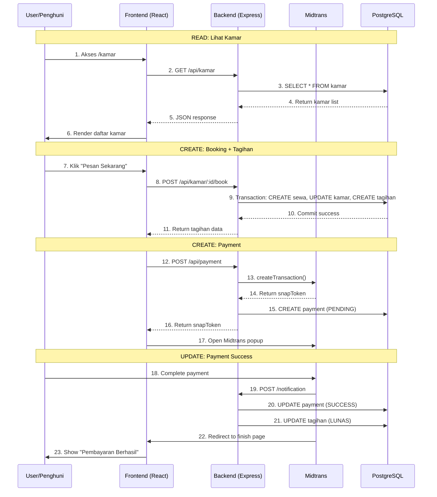

# Fitur Utama CRUD Tagihan dan Pembayaran

Dokumentasi alur MVC (Model-View-Controller) pada fitur CRUD Tagihan dan Pembayaran yang menjelaskan setiap step dalam proses pemesanan, pembayaran, dan pembatalan.

---

## Daftar Isi

1. [Arsitektur MVC dalam Sistem](#arsitektur-mvc-dalam-sistem)
2. [Read: Melihat Daftar Kamar](#1-read-melihat-daftar-kamar)
3. [Read: Melihat Detail Kamar](#2-read-melihat-detail-kamar)
4. [Create: Pemesanan Kamar](#3-create-pemesanan-kamar)
5. [Create: Membuat Tagihan](#4-create-membuat-tagihan)
6. [Create: Membuat Pembayaran](#5-create-membuat-pembayaran)
7. [Read: Melihat Daftar Tagihan](#6-read-melihat-daftar-tagihan)
8. [Read: Melihat Daftar Pembayaran](#7-read-melihat-daftar-pembayaran)
9. [Update & Delete: Pembatalan Pembayaran](#8-update--delete-pembatalan-pembayaran)
10. [Update: Pembayaran Berhasil](#9-update-pembayaran-berhasil)

---

## Arsitektur MVC dalam Sistem

Sistem ini mengimplementasikan arsitektur **MVCS (Model-View-Controller-Service)**:

| Layer | Tanggung Jawab | Lokasi |
|-------|----------------|--------|
| **Model** | Struktur data & relasi database (Prisma ORM) | `backend/prisma/schema.prisma` |
| **View** | Antarmuka pengguna (React.js) | `frontend/src/pages/` |
| **Controller** | Menerima request & mengembalikan response | `backend/src/controllers/` |
| **Service** | Logika bisnis & interaksi dengan database | `backend/src/services/` |
| **Routes** | Definisi endpoint API & middleware | `backend/src/routes/` |

---

## 1. READ: Melihat Daftar Kamar

> **File:** [KamarList.jsx](/frontend/src/pages/kamar/KamarList.jsx#L21-L57)

Ketika penghuni mengakses halaman `/kamar`, sistem menampilkan daftar semua kamar yang tersedia.

### View: Component State & Fetch

```jsx
// KamarList.jsx - Line 21-57
const KamarList = () => {
    const { user } = useAuthStore();
    const {
        kamar,
        kategori,
        meta,
        isLoading,
        fetchKamar,
        fetchKategori
    } = useKamarStore();

    const [filters, setFilters] = useState({
        search: '',
        status: '',
        kategoriId: '',
        page: 1,
        limit: 12
    });

    useEffect(() => {
        fetchKategori();
    }, []);

    useEffect(() => {
        const params = {
            page: filters.page,
            limit: filters.limit,
            ...(filters.search && { search: filters.search }),
            ...(filters.status && { status: filters.status }),
            ...(filters.kategoriId && { kategoriId: filters.kategoriId })
        };
        fetchKamar(params);
    }, [filters]);
};
```

**Penjelasan:**
- View menggunakan Zustand store (`useKamarStore`) untuk state management
- Filter mendukung pencarian, status, dan kategori
- Data diambil ulang setiap kali filter berubah

### Store: State Management

> **File:** [kamarStore.js](/frontend/src/features/kamar/kamarStore.js#L19-L33)

```javascript
// kamarStore.js - Line 19-33
fetchKamar: async (params = {}) => {
    set({ isLoading: true, error: null });
    try {
        const response = await kamarService.getAll(params);
        set({
            kamar: response.data,
            meta: response.meta,
            isLoading: false,
        });
        return response;
    } catch (error) {
        set({ isLoading: false, error: error.message });
        throw error;
    }
},
```

### Service (Frontend): API Client

> **File:** [kamar.service.js](/frontend/src/services/kamar.service.js#L37-L39)

```javascript
// kamar.service.js - Line 37-39
getAll: async (params = {}) => {
    return api.get('/kamar', { params });
},
```

### Routes: Endpoint Definition

> **File:** [kamar.routes.js](/backend/src/routes/kamar.routes.js#L38)

```javascript
// kamar.routes.js - Line 38
// Public/Optional auth: view kamar
router.get('/', optionalAuth, kamarController.getAllKamar);
```

### Controller: Handle Request

> **File:** [kamar.controller.js](/backend/src/controllers/kamar.controller.js#L60-L71)

```javascript
// kamar.controller.js - Line 60-71
const getAllKamar = async (req, res, next) => {
    try {
        const result = await kamarService.getAllKamar(req.query);
        return success(res, 'Berhasil mendapatkan daftar kamar', result.kamar, result.meta);
    } catch (error) {
        next(error);
    }
};
```

### Service (Backend): Business Logic

> **File:** [kamar.service.js](/backend/src/services/kamar.service.js#L60-L99)

```javascript
// kamar.service.js - Line 60-99
const getAllKamar = async (query = {}) => {
    const { page = 1, limit = 10, search, status, kategoriId, minPrice, maxPrice } = query;
    const pagination = paginate(page, limit);

    const where = {
        deletedAt: null,
        ...(search && {
            OR: [
                { namaKamar: { contains: search, mode: 'insensitive' } },
                { nomorKamar: { contains: search, mode: 'insensitive' } }
            ]
        }),
        ...(status && { status }),
        ...(kategoriId && { kategoriId: parseInt(kategoriId) }),
        ...(minPrice && { hargaPerBulan: { gte: parseFloat(minPrice) } }),
        ...(maxPrice && { hargaPerBulan: { lte: parseFloat(maxPrice) } })
    };

    const [kamar, total] = await Promise.all([
        prisma.kamar.findMany({
            where,
            ...pagination,
            orderBy: { createdAt: 'desc' },
            include: {
                kategori: { select: { namaKategori: true } },
                fotoKamar: { orderBy: { urutan: 'asc' }, take: 1 },
                _count: { select: { riwayatSewa: true } }
            }
        }),
        prisma.kamar.count({ where })
    ]);

    return {
        kamar,
        meta: paginationMeta(total, page, limit)
    };
};
```

**Penjelasan:**
- Service mendukung filter: search, status, kategoriId, minPrice, maxPrice
- Query menggunakan Prisma dengan pagination
- Include relasi kategori dan foto (hanya 1 foto pertama untuk performa)

### Model: Prisma Schema

> **File:** [schema.prisma](/backend/prisma/schema.prisma)

```prisma
model Kamar {
  id              Int       @id @default(autoincrement())
  nomorKamar      String?   @map("nomor_kamar") @db.VarChar(50)
  namaKamar       String    @unique @map("nama_kamar") @db.VarChar(255)
  kategoriId      Int?      @map("kategori_id")
  hargaPerBulan   Decimal?  @map("harga_per_bulan") @db.Decimal(15, 2)
  luasKamar       Decimal?  @map("luas_kamar") @db.Decimal(10, 2)
  lantai          Int?
  status          StatusKamar @default(TERSEDIA)
  deskripsi       String?   @db.Text
  createdAt       DateTime  @default(now()) @map("created_at")
  updatedAt       DateTime  @updatedAt @map("updated_at")
  deletedAt       DateTime? @map("deleted_at")

  // Relations
  kategori        KategoriKamar? @relation(fields: [kategoriId], references: [id])
  fotoKamar       FotoKamar[]
  fasilitasDetail FasilitasKamar[]
  inventori       InventoriKamar[]
  riwayatSewa     RiwayatSewa[]

  @@map("kamar")
}

enum StatusKamar {
  TERSEDIA
  TERISI
  PERBAIKAN
}
```

---

## 2. READ: Melihat Detail Kamar

> **File:** [KamarDetail.jsx](/frontend/src/pages/kamar/KamarDetail.jsx#L28-L65)

Ketika penghuni mengklik salah satu kamar, sistem menampilkan detail kamar beserta foto, fasilitas, dan opsi pemesanan.

### View: Component State & Fetch

```jsx
// KamarDetail.jsx - Line 28-65
const KamarDetail = () => {
    const { id } = useParams();
    const navigate = useNavigate();
    const { user } = useAuthStore();
    const {
        selectedKamar: kamar,
        isLoading,
        fetchKamarById,
        deleteKamar,
        updateKamarStatus
    } = useKamarStore();

    const isPemilik = user?.role === 'PEMILIK';
    const isPenghuni = user?.role === 'PENGHUNI';

    // Booking state
    const [durasiSewa, setDurasiSewa] = useState(1);
    const [isBooking, setIsBooking] = useState(false);
    const [showBookingConfirm, setShowBookingConfirm] = useState(false);

    // Find current user's active rental for this room
    const myActiveRental = kamar?.riwayatSewa?.find(
        sewa => sewa.userId === user?.id && sewa.status === 'AKTIF'
    );

    useEffect(() => {
        if (id) {
            fetchKamarById(id);
        }
    }, [id]);
};
```

**Penjelasan:**
- View menggunakan Zustand store dengan `selectedKamar`
- Mendukung dua role: PEMILIK (edit) dan PENGHUNI (booking)
- Cek apakah user sedang menyewa kamar ini (`myActiveRental`)

### Store: Fetch By ID

> **File:** [kamarStore.js](/frontend/src/features/kamar/kamarStore.js#L36-L46)

```javascript
// kamarStore.js - Line 36-46
fetchKamarById: async (id) => {
    set({ isLoading: true, error: null });
    try {
        const response = await kamarService.getById(id);
        set({ selectedKamar: response.data, isLoading: false });
        return response;
    } catch (error) {
        set({ isLoading: false, error: error.message });
        throw error;
    }
},
```

### Service (Frontend): API Client

> **File:** [kamar.service.js](/frontend/src/services/kamar.service.js#L44-L46)

```javascript
// kamar.service.js - Line 44-46
getById: async (id) => {
    return api.get(`/kamar/${id}`);
},
```

### Routes: Endpoint Definition

> **File:** [kamar.routes.js](/backend/src/routes/kamar.routes.js#L39)

```javascript
// kamar.routes.js - Line 39
router.get('/:id', optionalAuth, kamarController.getKamarById);
```

### Controller: Handle Request

> **File:** [kamar.controller.js](/backend/src/controllers/kamar.controller.js#L73-L84)

```javascript
// kamar.controller.js - Line 73-84
const getKamarById = async (req, res, next) => {
    try {
        const kamar = await kamarService.getKamarById(req.params.id);
        return success(res, 'Berhasil mendapatkan data kamar', kamar);
    } catch (error) {
        next(error);
    }
};
```

### Service (Backend): Business Logic

> **File:** [kamar.service.js](/backend/src/services/kamar.service.js#L101-L133)

```javascript
// kamar.service.js - Line 101-133
const getKamarById = async (id) => {
    const kamar = await prisma.kamar.findUnique({
        where: { id: parseInt(id), deletedAt: null },
        include: {
            kategori: true,
            fotoKamar: { orderBy: { urutan: 'asc' } },
            fasilitasDetail: true,
            inventori: {
                include: {
                    barang: {
                        include: { namaBarang: true }
                    }
                }
            },
            // Include rental history with user info
            riwayatSewa: {
                orderBy: { tanggalMulai: 'desc' },
                include: {
                    user: { select: { id: true, name: true, email: true, noTelepon: true } }
                }
            }
        }
    });

    if (!kamar) {
        throw { statusCode: 404, message: 'Kamar tidak ditemukan' };
    }

    return kamar;
};
```

**Penjelasan:**
- Prisma menggunakan `findUnique` dengan `include` untuk relasi lengkap
- Data include: kategori, semua foto, fasilitas, inventori, dan riwayat sewa
- Riwayat sewa termasuk data user untuk tampilan riwayat penghuni

---

## 3. CREATE: Pemesanan Kamar

> **File:** [KamarDetail.jsx](/frontend/src/pages/kamar/KamarDetail.jsx#L491-L548)

Ketika penghuni menekan tombol **"Pesan & Bayar Sekarang"**, sistem menampilkan form pemilihan durasi sewa:

### View: Booking Section UI

```jsx
// KamarDetail.jsx - Line 491-548
{/* Booking Section for Penghuni */}
{isPenghuni && kamar.status === 'TERSEDIA' && (
    <div className="card">
        <div className="card-header">
            <h3 className="font-semibold text-gray-900 flex items-center gap-2">
                <HiShoppingCart className="w-5 h-5" />
                Pesan Kamar Ini
            </h3>
        </div>
        <div className="card-body space-y-4">
            {/* Duration Selector */}
            <div>
                <label className="label">Durasi Sewa</label>
                <select
                    value={durasiSewa}
                    onChange={(e) => setDurasiSewa(parseInt(e.target.value))}
                    className="input w-full"
                >
                    {[1, 2, 3, 4, 5, 6, 9, 12].map((bulan) => (
                        <option key={bulan} value={bulan}>
                            {bulan} Bulan
                        </option>
                    ))}
                </select>
            </div>

            {/* Price Summary */}
            <div className="bg-gray-50 rounded-lg p-4 space-y-2">
                <div className="flex justify-between text-gray-600">
                    <span>Harga per bulan</span>
                    <span>{formatRupiah(kamar.hargaPerBulan)}</span>
                </div>
                <div className="flex justify-between text-gray-600">
                    <span>Durasi</span>
                    <span>{durasiSewa} bulan</span>
                </div>
                <hr className="border-gray-200" />
                <div className="flex justify-between font-bold text-lg">
                    <span>Total</span>
                    <span className="text-primary-600">{formatRupiah(totalHarga)}</span>
                </div>
            </div>

            {/* Book Button */}
            <button
                onClick={() => setShowBookingConfirm(true)}
                disabled={isBooking}
                className="btn-primary w-full inline-flex items-center justify-center gap-2"
            >
                <HiCreditCard className="w-5 h-5" />
                Pesan & Bayar Sekarang
            </button>
        </div>
    </div>
)}
```

**Penjelasan:**
- Form hanya tampil jika user adalah PENGHUNI dan kamar TERSEDIA
- User dapat memilih durasi sewa (1-12 bulan)
- Total harga dihitung otomatis: `hargaPerBulan × durasiSewa`

### View: Handle Booking Function

> **File:** [KamarDetail.jsx](/frontend/src/pages/kamar/KamarDetail.jsx#L101-L138)

```jsx
// KamarDetail.jsx - Line 101-138
const handleBookRoom = async () => {
    if (!user) {
        toast.error('Silakan login terlebih dahulu');
        navigate('/login');
        return;
    }

    setIsBooking(true);
    try {
        // Create booking
        const bookingResponse = await kamarService.bookRoom(id, durasiSewa);
        const tagihanId = bookingResponse.data?.tagihan?.id;

        if (!tagihanId) {
            throw new Error('Gagal membuat tagihan');
        }

        toast.success('Booking berhasil! Melanjutkan ke pembayaran...');

        // Create payment
        const paymentResponse = await paymentService.create({ tagihanId });

        if (paymentResponse.data?.redirectUrl) {
            window.location.href = paymentResponse.data.redirectUrl;
        } else if (paymentResponse.data?.snapRedirectUrl) {
            window.location.href = paymentResponse.data.snapRedirectUrl;
        } else {
            // Redirect to tagihan page to pay later
            toast.info('Silakan lakukan pembayaran di halaman tagihan');
            navigate('/tagihan');
        }
    } catch (error) {
        toast.error(error.message || 'Gagal melakukan booking');
    } finally {
        setIsBooking(false);
        setShowBookingConfirm(false);
    }
};
```

**Penjelasan:**
- Validasi login sebelum booking
- Memanggil `kamarService.bookRoom()` untuk membuat booking + tagihan
- Langsung membuat payment dan redirect ke Midtrans

### Service (Frontend): API Client

> **File:** [kamar.service.js](/frontend/src/services/kamar.service.js#L115-L117)

```javascript
// kamar.service.js - Line 115-117
bookRoom: async (kamarId, durasiSewa) => {
    return api.post(`/kamar/${kamarId}/book`, { durasiSewa });
},
```

### Routes: Booking Endpoint

> **File:** [kamar.routes.js](/backend/src/routes/kamar.routes.js#L51)

```javascript
// kamar.routes.js - Line 51
// Penghuni: book a room
router.post('/:id/book', authenticate, kamarController.bookKamar);
```

### Controller: Create Booking

> **File:** [kamar.controller.js](/backend/src/controllers/kamar.controller.js#L195-L211)

```javascript
// kamar.controller.js - Line 195-211
/**
 * Book a room (Penghuni self-service)
 * POST /api/kamar/:id/book
 */
const bookKamar = async (req, res, next) => {
    try {
        const bookingService = require('../services/booking.service');
        const result = await bookingService.createBooking(
            req.user.id,
            req.params.id,
            req.body.durasiSewa
        );
        return created(res, 'Booking berhasil dibuat', result);
    } catch (error) {
        next(error);
    }
};
```

---

## 4. CREATE: Membuat Tagihan

> **File:** [booking.service.js](/backend/src/services/booking.service.js#L4-L114)

Service `createBooking` melakukan validasi dan 3 operasi dalam satu transaction:

### Service (Backend): Business Logic

```javascript
// booking.service.js - Line 4-114
/**
 * Create a room booking (self-service rental)
 * Creates RiwayatSewa + initial Tagihan
 */
const createBooking = async (userId, kamarId, durasiSewa) => {
    // Validate duration
    if (!durasiSewa || durasiSewa < 1 || durasiSewa > 24) {
        throw { statusCode: 400, message: 'Durasi sewa harus antara 1-24 bulan' };
    }

    // Get kamar
    const kamar = await prisma.kamar.findUnique({
        where: { id: parseInt(kamarId) }
    });

    if (!kamar) {
        throw { statusCode: 404, message: 'Kamar tidak ditemukan' };
    }

    if (kamar.status !== 'TERSEDIA') {
        throw { statusCode: 400, message: 'Kamar tidak tersedia untuk disewa' };
    }

    if (!kamar.hargaPerBulan) {
        throw { statusCode: 400, message: 'Harga kamar belum ditentukan' };
    }

    // Check if user already has active rental
    const userActiveRental = await prisma.riwayatSewa.findFirst({
        where: {
            userId: parseInt(userId),
            status: 'AKTIF'
        }
    });

    if (userActiveRental) {
        throw { statusCode: 400, message: 'Anda sudah memiliki sewa aktif. Selesaikan dahulu sebelum menyewa kamar lain.' };
    }

    // Check if kamar already has active rental
    const kamarActiveRental = await prisma.riwayatSewa.findFirst({
        where: {
            kamarId: parseInt(kamarId),
            status: 'AKTIF'
        }
    });

    if (kamarActiveRental) {
        throw { statusCode: 400, message: 'Kamar ini sedang disewa oleh penghuni lain.' };
    }

    // Calculate dates
    const tanggalMulai = new Date();
    const tanggalBerakhir = new Date();
    tanggalBerakhir.setMonth(tanggalBerakhir.getMonth() + parseInt(durasiSewa));

    // Calculate total amount
    const totalHarga = parseFloat(kamar.hargaPerBulan) * parseInt(durasiSewa);

    // Create booking in transaction
    const result = await prisma.$transaction(async (tx) => {
        // 1. CREATE: RiwayatSewa
        const kodeSewa = generateCode('SWA');
        const riwayatSewa = await tx.riwayatSewa.create({
            data: {
                kodeSewa,
                userId: parseInt(userId),
                kamarId: parseInt(kamarId),
                tanggalMulai,
                tanggalBerakhir,
                hargaSewa: kamar.hargaPerBulan,
                status: 'AKTIF',
                durasiBulan: parseInt(durasiSewa)
            }
        });

        // 2. UPDATE: Kamar status to TERISI immediately
        await tx.kamar.update({
            where: { id: parseInt(kamarId) },
            data: { status: 'TERISI' }
        });

        // 3. CREATE: Initial Tagihan for payment
        const nomorTagihan = generateCode('TGH');
        const tagihan = await tx.tagihan.create({
            data: {
                nomorTagihan,
                userId: parseInt(userId),
                riwayatSewaId: riwayatSewa.id,
                jenisTagihan: 'SEWA',
                nominal: totalHarga,
                tanggalJatuhTempo: new Date(Date.now() + 24 * 60 * 60 * 1000), // 1 day to pay
                status: 'BELUM_LUNAS',
                keterangan: `Pembayaran sewa kamar ${kamar.namaKamar} untuk ${durasiSewa} bulan`
            }
        });

        return {
            riwayatSewa,
            tagihan,
            kamar,
            durasiSewa: parseInt(durasiSewa),
            totalHarga
        };
    });

    return result;
};
```

**Penjelasan:**
- **Validasi durasi**: 1-24 bulan
- **Validasi kamar**: harus TERSEDIA dan memiliki harga
- **Validasi user**: tidak boleh memiliki sewa aktif lain
- **Validasi kamar**: tidak boleh sudah ada penyewa aktif
- **Transaction**: memastikan semua operasi berhasil atau rollback

### Model: RiwayatSewa & Tagihan Schema

> **File:** [schema.prisma](/backend/prisma/schema.prisma)

```prisma
model RiwayatSewa {
  id              Int       @id @default(autoincrement())
  kodeSewa        String    @unique @map("kode_sewa") @db.VarChar(100)
  userId          Int       @map("user_id")
  kamarId         Int       @map("kamar_id")
  tanggalMulai    DateTime  @map("tanggal_mulai") @db.Date
  tanggalBerakhir DateTime  @map("tanggal_berakhir") @db.Date
  hargaSewa       Decimal?  @map("harga_sewa") @db.Decimal(15, 2)
  durasiBulan     Int?      @map("durasi_bulan")
  status          StatusSewa @default(AKTIF)
  catatan         String?   @db.Text
  createdAt       DateTime  @default(now()) @map("created_at")
  updatedAt       DateTime  @updatedAt @map("updated_at")

  // Relations
  user            User      @relation(fields: [userId], references: [id])
  kamar           Kamar     @relation(fields: [kamarId], references: [id])
  tagihan         Tagihan[]
  payment         Payment[]

  @@map("riwayat_sewa")
}

model Tagihan {
  id                Int       @id @default(autoincrement())
  nomorTagihan      String    @unique @map("nomor_tagihan") @db.VarChar(100)
  riwayatSewaId     Int       @map("riwayat_sewa_id")
  userId            Int       @map("user_id")
  jenisTagihan      String?   @map("jenis_tagihan") @db.VarChar(50)
  nominal           Decimal   @db.Decimal(15, 2)
  tanggalJatuhTempo DateTime  @map("tanggal_jatuh_tempo") @db.Date
  status            StatusTagihan @default(BELUM_LUNAS)
  keterangan        String?   @db.Text
  createdAt         DateTime  @default(now()) @map("created_at")
  updatedAt         DateTime  @updatedAt @map("updated_at")

  // Relations
  riwayatSewa       RiwayatSewa @relation(fields: [riwayatSewaId], references: [id])
  user              User        @relation(fields: [userId], references: [id])
  payment           Payment[]

  @@map("tagihan")
}

enum StatusSewa {
  AKTIF
  SELESAI
  DIBATALKAN
}

enum StatusTagihan {
  BELUM_LUNAS
  LUNAS
  JATUH_TEMPO
}
```

**Penjelasan:**
- **RiwayatSewa**: menyimpan data sewa dengan relasi ke User dan Kamar
- **Tagihan**: menyimpan data tagihan dengan relasi ke RiwayatSewa
- Jatuh tempo tagihan: 1 hari setelah booking dibuat
- Kamar langsung berubah status menjadi `TERISI` saat booking

---

## 5. CREATE: Membuat Pembayaran

> **File:** [TagihanList.jsx](/frontend/src/pages/tagihan/TagihanList.jsx#L174-L212)

Ketika penghuni menekan tombol **"Bayar"** pada tagihan:

### View: Handle Pay Now

```jsx
// TagihanList.jsx - Line 174-212
const handlePayNow = async (tagihanItem) => {
    setPayingId(tagihanItem.id);
    try {
        const response = await paymentService.create({
            tagihanId: tagihanItem.id
        });

        // Prefer redirect URL for simplicity
        if (response.data?.redirectUrl) {
            window.location.href = response.data.redirectUrl;
        } else if (response.data?.snapRedirectUrl) {
            window.location.href = response.data.snapRedirectUrl;
        } else if (response.data?.snapToken && window.snap) {
            // Use Midtrans Snap popup if available
            window.snap.pay(response.data.snapToken, {
                onSuccess: () => {
                    toast.success('Pembayaran berhasil!');
                    fetchTagihan(filters);
                    fetchSummary();
                },
                onPending: () => {
                    toast.info('Menunggu pembayaran...');
                },
                onError: () => {
                    toast.error('Pembayaran gagal');
                },
                onClose: () => {
                    toast.info('Pembayaran dibatalkan');
                }
            });
        } else {
            toast.error('Tidak dapat memproses pembayaran. Coba lagi nanti.');
        }
    } catch (error) {
        toast.error(error.message || 'Gagal memproses pembayaran');
    } finally {
        setPayingId(null);
    }
};
```

**Penjelasan:**
- Prioritas redirect URL untuk kemudahan (tanpa popup)
- Fallback ke Snap popup jika redirect URL tidak tersedia
- State `payingId` untuk menandai tagihan yang sedang diproses

### Service (Frontend): Create Payment

> **File:** [payment.service.js](/frontend/src/services/payment.service.js#L18-L23)

```javascript
// payment.service.js - Line 18-23
/**
 * Create payment (initiate Midtrans transaction)
 */
create: async (data) => {
    return api.post('/payment', data);
},
```

### Controller: Create Payment

> **File:** [payment.controller.js](/backend/src/controllers/payment.controller.js#L30-L41)

```javascript
// payment.controller.js - Line 30-41
/**
 * Create payment (Penghuni)
 * POST /api/payment
 */
const createPayment = async (req, res, next) => {
    try {
        const result = await paymentService.createPayment(req.body.tagihanId, req.user.id);
        return created(res, 'Pembayaran berhasil dibuat', result);
    } catch (error) {
        next(error);
    }
};
```

### Service (Backend): Create Payment Logic

> **File:** [payment.service.js](/backend/src/services/payment.service.js#L64-L184)

```javascript
// payment.service.js - Line 64-184
const createPayment = async (tagihanId, userId) => {
    // Validate tagihanId
    if (!tagihanId || isNaN(parseInt(tagihanId))) {
        throw { statusCode: 400, message: 'Tagihan ID tidak valid' };
    }

    const parsedTagihanId = parseInt(tagihanId);

    // Get tagihan
    const tagihan = await prisma.tagihan.findUnique({
        where: { id: parsedTagihanId },
        include: {
            user: true,
            riwayatSewa: { include: { kamar: true } }
        }
    });

    if (!tagihan) {
        throw { statusCode: 404, message: 'Tagihan tidak ditemukan' };
    }

    if (tagihan.status === 'LUNAS') {
        throw { statusCode: 400, message: 'Tagihan sudah lunas' };
    }

    // Check if there's already a SUCCESS payment for this tagihan
    const existingSuccessPayment = await prisma.payment.findFirst({
        where: {
            tagihanId: parsedTagihanId,
            status: 'SUCCESS'
        }
    });

    if (existingSuccessPayment) {
        throw { statusCode: 400, message: 'Tagihan ini sudah memiliki pembayaran yang berhasil' };
    }

    // Check if there's an existing PENDING payment with valid token (created within 24 hours)
    const existingPendingPayment = await prisma.payment.findFirst({
        where: {
            tagihanId: parsedTagihanId,
            status: 'PENDING',
            snapToken: { not: null },
            createdAt: {
                gte: new Date(Date.now() - 24 * 60 * 60 * 1000) // Created within last 24 hours
            }
        },
        include: { tagihan: true }
    });

    // If valid pending payment exists, return it instead of creating new one
    if (existingPendingPayment && existingPendingPayment.snapToken) {
        return {
            payment: existingPendingPayment,
            snapToken: existingPendingPayment.snapToken,
            redirectUrl: existingPendingPayment.snapRedirectUrl,
            isReused: true // Flag to indicate this is an existing payment
        };
    }

    // Check if user owns this tagihan
    if (tagihan.userId !== userId) {
        throw { statusCode: 403, message: 'Anda tidak memiliki akses ke tagihan ini' };
    }

    const kodePembayaran = generateCode('PAY');

    // Create Midtrans transaction
    const parameter = {
        transaction_details: {
            order_id: kodePembayaran,
            gross_amount: parseInt(tagihan.nominal)
        },
        customer_details: {
            first_name: tagihan.user.name,
            email: tagihan.user.email,
            phone: tagihan.user.noTelepon || ''
        },
        item_details: [{
            id: tagihan.nomorTagihan,
            price: parseInt(tagihan.nominal),
            quantity: 1,
            name: `Pembayaran ${tagihan.jenisTagihan || 'Sewa'} - ${tagihan.riwayatSewa.kamar.namaKamar}`
        }],
        callbacks: {
            finish: `${process.env.FRONTEND_URL}/payment/finish`
        },
        expiry: {
            unit: 'hours',
            duration: 24
        }
    };

    const transaction = await snap.createTransaction(parameter);

    // Create payment record
    const payment = await prisma.payment.create({
        data: {
            kodePembayaran,
            tagihanId: tagihan.id,
            userId,
            riwayatSewaId: tagihan.riwayatSewaId,
            grossAmount: tagihan.nominal,
            status: 'PENDING',
            snapToken: transaction.token,
            snapRedirectUrl: transaction.redirect_url
        },
        include: { tagihan: true }
    });

    return {
        payment,
        snapToken: transaction.token,
        redirectUrl: transaction.redirect_url
    };
};
```

**Penjelasan:**
- **Validasi tagihan**: harus ada dan belum LUNAS
- **Cek duplikat**: tidak boleh ada payment SUCCESS untuk tagihan ini
- **Reuse pending payment**: jika sudah ada payment PENDING dalam 24 jam, gunakan yang ada
- **Cek ownership**: user harus pemilik tagihan
- **Midtrans integration**: membuat transaksi dengan item details dan callback URL
- **Expiry**: payment berlaku 24 jam

### Model: Payment Schema

> **File:** [schema.prisma](/backend/prisma/schema.prisma)

```prisma
model Payment {
  id              Int       @id @default(autoincrement())
  kodePembayaran  String    @unique @map("kode_pembayaran") @db.VarChar(100)
  tagihanId       Int?      @map("tagihan_id")
  userId          Int       @map("user_id")
  riwayatSewaId   Int       @map("riwayat_sewa_id")
  grossAmount     Decimal   @map("gross_amount") @db.Decimal(15, 2)
  status          StatusPayment @default(PENDING)
  snapToken       String?   @map("snap_token") @db.Text
  snapRedirectUrl String?   @map("snap_redirect_url") @db.Text
  transactionId   String?   @map("transaction_id") @db.VarChar(255)
  paymentMethod   String?   @map("payment_method") @db.VarChar(100)
  paymentGateway  String?   @map("payment_gateway") @db.VarChar(100)
  paidAt          DateTime? @map("paid_at")
  createdAt       DateTime  @default(now()) @map("created_at")
  updatedAt       DateTime  @updatedAt @map("updated_at")

  // Relations
  tagihan         Tagihan?    @relation(fields: [tagihanId], references: [id])
  user            User        @relation(fields: [userId], references: [id])
  riwayatSewa     RiwayatSewa @relation(fields: [riwayatSewaId], references: [id])

  @@map("payment")
}

enum StatusPayment {
  PENDING
  SUCCESS
  FAILED
  EXPIRED
  CANCEL
}
```

---

## 6. READ: Melihat Daftar Tagihan

> **File:** [TagihanList.jsx](/frontend/src/pages/tagihan/TagihanList.jsx#L28-L136)

Ketika penghuni mengakses halaman `/tagihan`:

### View: Component State & Fetch

```jsx
// TagihanList.jsx - Line 28-136
const TagihanList = () => {
    const navigate = useNavigate();
    const [searchParams, setSearchParams] = useSearchParams();
    const { user } = useAuthStore();
    const {
        tagihan,
        summary,
        meta,
        isLoading,
        fetchTagihan,
        fetchSummary,
        generateMonthly,
        deleteTagihan
    } = useTagihanStore();

    const isPemilik = user?.role === 'PEMILIK';

    const [filters, setFilters] = useState({
        search: '',
        status: '',
        page: 1,
        limit: 10
    });

    useEffect(() => {
        fetchSummary();
    }, []);

    useEffect(() => {
        const params = {
            page: filters.page,
            limit: filters.limit,
            ...(filters.status && { status: filters.status })
        };
        fetchTagihan(params);
    }, [filters]);

    const handleFilterChange = (key, value) => {
        setFilters(prev => ({ ...prev, [key]: value, page: 1 }));
    };

    const handlePageChange = (newPage) => {
        setFilters(prev => ({ ...prev, page: newPage }));
    };
};
```

**Penjelasan:**
- View menggunakan Zustand store (`useTagihanStore`) untuk state management
- Mendukung filter status dan pagination
- Summary dan tagihan difetch saat halaman dimuat

### Store: Fetch Tagihan

> **File:** [tagihanStore.js](/frontend/src/features/tagihan/tagihanStore.js)

```javascript
// tagihanStore.js - fetchTagihan
fetchTagihan: async (params = {}) => {
    set({ isLoading: true, error: null });
    try {
        const response = await tagihanService.getAll(params);
        set({
            tagihan: response.data,
            meta: response.meta,
            isLoading: false,
        });
        return response;
    } catch (error) {
        set({ isLoading: false, error: error.message });
        throw error;
    }
},
```

### Service (Frontend): API Client

> **File:** [tagihan.service.js](/frontend/src/services/tagihan.service.js#L7-L9)

```javascript
// tagihan.service.js - Line 7-9
getAll: async (params = {}) => {
    return api.get('/tagihan', { params });
},
```

### Controller: Get All Tagihan

> **File:** [tagihan.controller.js](/backend/src/controllers/tagihan.controller.js#L4-L15)

```javascript
// tagihan.controller.js - Line 4-15
/**
 * Get all tagihan
 * GET /api/tagihan
 */
const getAllTagihan = async (req, res, next) => {
    try {
        const result = await tagihanService.getAllTagihan(req.query, req.user.id, req.user.role);
        return success(res, 'Berhasil mendapatkan daftar tagihan', result.tagihan, result.meta);
    } catch (error) {
        next(error);
    }
};
```

### Service (Backend): Business Logic

> **File:** [tagihan.service.js](/backend/src/services/tagihan.service.js#L5-L40)

```javascript
// tagihan.service.js - Line 5-40
const getAllTagihan = async (query = {}, userId = null, role = null) => {
    const { page = 1, limit = 10, status, userId: filterUserId } = query;
    const pagination = paginate(page, limit);

    const where = {
        // If penghuni, only show their own tagihan
        ...(role === 'PENGHUNI' && { userId }),
        // If pemilik filtering by user
        ...(role === 'PEMILIK' && filterUserId && { userId: parseInt(filterUserId) }),
        ...(status && { status })
    };

    const [tagihan, total] = await Promise.all([
        prisma.tagihan.findMany({
            where,
            ...pagination,
            orderBy: { tanggalJatuhTempo: 'asc' },
            include: {
                user: { select: { id: true, name: true, email: true } },
                riwayatSewa: {
                    include: { kamar: { select: { id: true, namaKamar: true } } }
                },
                payment: { select: { id: true, status: true, paidAt: true } }
            }
        }),
        prisma.tagihan.count({ where })
    ]);

    return {
        tagihan,
        meta: paginationMeta(total, page, limit)
    };
};
```

**Penjelasan:**
- **Role-based filtering**: Penghuni hanya melihat tagihan sendiri
- **Pemilik**: dapat melihat semua atau filter per user
- **OrderBy**: diurutkan berdasarkan jatuh tempo (ASC)
- **Include**: relasi user, kamar, dan status payment

---

## 7. READ: Melihat Daftar Pembayaran

> **File:** [PaymentList.jsx](/frontend/src/pages/payment/PaymentList.jsx#L29-L149)

Ketika penghuni atau pemilik mengakses halaman `/payment`:

### View: Component State & Fetch

```jsx
// PaymentList.jsx - Line 29-149
const PaymentList = () => {
    const { user } = useAuthStore();
    const [searchParams, setSearchParams] = useSearchParams();
    const isPemilik = user?.role === 'PEMILIK';

    // State for regular (penghuni) view
    const [payments, setPayments] = useState([]);
    const [meta, setMeta] = useState(null);

    // State for grouped (pemilik) view
    const [groupedUsers, setGroupedUsers] = useState([]);
    const [expandedUsers, setExpandedUsers] = useState({});

    // Common state
    const [isLoading, setIsLoading] = useState(true);
    const [summary, setSummary] = useState({ total: 0, success: 0, pending: 0, failed: 0 });

    // Filters for pemilik view
    const [pemilikFilters, setPemilikFilters] = useState({
        search: '',
        paymentStatus: '',
        rentalStatus: 'SEMUA'
    });

    // Filters for penghuni view
    const [filters, setFilters] = useState({
        status: '',
        page: 1,
        limit: 10
    });

    const [cancelModal, setCancelModal] = useState({ isOpen: false, paymentId: null, isLoading: false });

    // Fetch for pemilik (grouped view)
    const fetchGroupedPayments = async () => {
        setIsLoading(true);
        try {
            const params = {
                ...(pemilikFilters.search && { search: pemilikFilters.search }),
                ...(pemilikFilters.paymentStatus && { paymentStatus: pemilikFilters.paymentStatus }),
                ...(pemilikFilters.rentalStatus && { rentalStatus: pemilikFilters.rentalStatus })
            };
            const response = await paymentService.getGroupedByUser(params);
            setGroupedUsers(response.data || []);
        } catch (error) {
            toast.error(error.message || 'Gagal memuat data pembayaran');
        } finally {
            setIsLoading(false);
        }
    };

    // Fetch for penghuni (regular view)
    const fetchPayments = async () => {
        setIsLoading(true);
        try {
            const params = {
                page: filters.page,
                limit: filters.limit,
                ...(filters.status && { status: filters.status })
            };
            const response = await paymentService.getAll(params);
            setPayments(response.data || []);
            setMeta(response.meta);
        } catch (error) {
            toast.error(error.message || 'Gagal memuat data pembayaran');
        } finally {
            setIsLoading(false);
        }
    };

    useEffect(() => {
        fetchSummary();
        if (isPemilik) {
            fetchGroupedPayments();
        } else {
            fetchPayments();
        }
    }, [isPemilik, filters, pemilikFilters]);
};
```

**Penjelasan:**
- **Dual view**: Pemilik melihat grouped by user, Penghuni melihat list biasa
- **State terpisah**: Pemilik dan Penghuni punya filter berbeda
- **Cancel modal**: untuk membatalkan payment PENDING

### Service (Frontend): Payment API Client

> **File:** [payment.service.js](/frontend/src/services/payment.service.js)

```javascript
// payment.service.js - Complete service
export const paymentService = {
    getAll: async (params = {}) => {
        return api.get('/payment', { params });
    },
    getById: async (id) => {
        return api.get(`/payment/${id}`);
    },
    create: async (data) => {
        return api.post('/payment', data);
    },
    verify: async (id) => {
        return api.post(`/payment/${id}/verify`);
    },
    checkStatus: async (id) => {
        return api.get(`/payment/${id}/status`);
    },
    syncStatus: async (orderId) => {
        return api.get(`/payment/sync/${orderId}`);
    },
    cancel: async (id) => {
        return api.post(`/payment/${id}/cancel`);
    },
    getGroupedByUser: async (params = {}) => {
        return api.get('/payment/grouped', { params });
    },
    getSummary: async () => {
        return api.get('/payment/summary');
    }
};
```

### Controller: Get All Payments

> **File:** [payment.controller.js](/backend/src/controllers/payment.controller.js#L4-L15)

```javascript
// payment.controller.js - Line 4-15
/**
 * Get all payments
 * GET /api/payment
 */
const getAllPayments = async (req, res, next) => {
    try {
        const result = await paymentService.getAllPayments(req.query, req.user.id, req.user.role);
        return success(res, 'Berhasil mendapatkan daftar pembayaran', result.payments, result.meta);
    } catch (error) {
        next(error);
    }
};
```

### Service (Backend): Business Logic

> **File:** [payment.service.js](/backend/src/services/payment.service.js#L7-L39)

```javascript
// payment.service.js - Line 7-39
const getAllPayments = async (query = {}, userId = null, role = null) => {
    const { page = 1, limit = 10, status } = query;
    const pagination = paginate(page, limit);

    const where = {
        ...(role === 'PENGHUNI' && { userId }),
        ...(status && { status })
    };

    const [payments, total] = await Promise.all([
        prisma.payment.findMany({
            where,
            ...pagination,
            orderBy: { createdAt: 'desc' },
            include: {
                user: { select: { id: true, name: true, email: true } },
                tagihan: true,
                riwayatSewa: {
                    include: { kamar: { select: { id: true, namaKamar: true } } }
                }
            }
        }),
        prisma.payment.count({ where })
    ]);

    return {
        payments,
        meta: paginationMeta(total, page, limit)
    };
};
```

**Penjelasan:**
- **Role-based filtering**: Penghuni hanya melihat payment sendiri
- **OrderBy**: diurutkan berdasarkan waktu pembuatan (DESC, terbaru di atas)
- **Include**: relasi user, tagihan, kamar untuk tampilan lengkap

---

## 8. UPDATE & DELETE: Pembatalan Pembayaran

> **File:** [PaymentList.jsx](/frontend/src/pages/payment/PaymentList.jsx#L202-L226)

Ketika penghuni atau pemilik menekan tombol **"Batalkan"** pada payment dengan status `PENDING`:

### View: Handle Cancel Modal

```jsx
// PaymentList.jsx - Line 202-226
const openCancelModal = (paymentId) => {
    setCancelModal({ isOpen: true, paymentId, isLoading: false });
};

const closeCancelModal = () => {
    setCancelModal({ isOpen: false, paymentId: null, isLoading: false });
};

const handleCancelPayment = async () => {
    setCancelModal(prev => ({ ...prev, isLoading: true }));
    try {
        await paymentService.cancel(cancelModal.paymentId);
        toast.success('Pembayaran berhasil dibatalkan');
        closeCancelModal();
        if (isPemilik) {
            fetchGroupedPayments();
        } else {
            fetchPayments();
        }
        fetchSummary();
    } catch (error) {
        toast.error(error.message || 'Gagal membatalkan pembayaran');
        setCancelModal(prev => ({ ...prev, isLoading: false }));
    }
};
```

**Penjelasan:**
- Modal konfirmasi sebelum membatalkan
- Setelah sukses, refresh data dan summary
- Pemilik dan Penghuni bisa membatalkan (dengan validasi ownership di backend)

### Service (Frontend): Cancel API

> **File:** [payment.service.js](/frontend/src/services/payment.service.js#L47-L51)

```javascript
// payment.service.js - Line 47-51
/**
 * Cancel payment
 */
cancel: async (id) => {
    return api.post(`/payment/${id}/cancel`);
},
```

### Routes: Cancel Endpoint

> **File:** [payment.routes.js](/backend/src/routes/payment.routes.js#L21-L22)

```javascript
// payment.routes.js - Line 21-22
// Cancel payment - both pemilik and penghuni can cancel
router.post('/:id/cancel', isAuthenticated, paymentController.cancelPayment);
```

### Controller: Cancel Payment

> **File:** [payment.controller.js](/backend/src/controllers/payment.controller.js#L95-L110)

```javascript
// payment.controller.js - Line 95-110
/**
 * Cancel payment
 * POST /api/payment/:id/cancel
 */
const cancelPayment = async (req, res, next) => {
    try {
        const payment = await paymentService.cancelPayment(
            req.params.id, 
            req.user.id, 
            req.user.role
        );
        return success(res, 'Pembayaran berhasil dibatalkan', payment);
    } catch (error) {
        next(error);
    }
};
```

### Service (Backend): Cancel Payment Logic

> **File:** [payment.service.js](/backend/src/services/payment.service.js#L591-L660)

```javascript
// payment.service.js - Line 591-660
/**
 * Cancel payment (by user or owner)
 */
const cancelPayment = async (paymentId, userId, role) => {
    const payment = await prisma.payment.findUnique({
        where: { id: parseInt(paymentId) },
        include: { 
            tagihan: true, 
            user: true,
            riwayatSewa: { include: { kamar: true } }
        }
    });

    if (!payment) {
        throw { statusCode: 404, message: 'Payment tidak ditemukan' };
    }

    // Only allow cancellation for PENDING payments
    if (payment.status !== 'PENDING') {
        throw { statusCode: 400, message: 'Hanya pembayaran dengan status PENDING yang dapat dibatalkan' };
    }

    // Check authorization: penghuni can only cancel their own, pemilik can cancel any
    if (role === 'PENGHUNI' && payment.userId !== userId) {
        throw { statusCode: 403, message: 'Tidak memiliki akses untuk membatalkan pembayaran ini' };
    }

    // Check if this is an extension payment
    const isExtension = payment.tagihan?.keterangan?.includes('Perpanjangan');

    // Update payment status to CANCEL (keep as history instead of deleting)
    await prisma.$transaction(async (tx) => {
        // 1. Update payment status to CANCEL and remove tagihanId reference
        await tx.payment.update({
            where: { id: parseInt(paymentId) },
            data: { 
                status: 'CANCEL',
                tagihanId: null  // Set to null before deleting tagihan
            }
        });

        // 2. Delete the tagihan
        if (payment.tagihanId) {
            await tx.tagihan.delete({
                where: { id: payment.tagihanId }
            });
        }

        // 3. For new bookings (not extension), update riwayatSewa and kamar
        if (!isExtension && payment.riwayatSewaId) {
            await tx.riwayatSewa.update({
                where: { id: payment.riwayatSewaId },
                data: { 
                    status: 'DIBATALKAN',
                    tanggalBerakhir: new Date()
                }
            });

            // Update kamar to TERSEDIA
            if (payment.riwayatSewa?.kamarId) {
                await tx.kamar.update({
                    where: { id: payment.riwayatSewa.kamarId },
                    data: { status: 'TERSEDIA' }
                });
            }
        }
    });

    return { message: isExtension ? 'Perpanjangan sewa berhasil dibatalkan.' : 'Pembayaran berhasil dibatalkan' };
};
```

**Penjelasan:**
- **Validasi status**: Hanya PENDING yang bisa dibatalkan
- **Validasi ownership**: Penghuni hanya bisa cancel milik sendiri, Pemilik bisa cancel semua
- **Transaction**:
  1. **UPDATE Payment**: status → CANCEL, tagihanId → null
  2. **DELETE Tagihan**: hapus dari database
  3. **UPDATE RiwayatSewa**: status → DIBATALKAN (untuk booking baru, bukan perpanjangan)
  4. **UPDATE Kamar**: status → TERSEDIA
- **Perpanjangan**: Jika pembatalan perpanjangan, kamar tetap TERISI

---

## 9. UPDATE: Pembayaran Berhasil

> **File:** [payment.routes.js](/backend/src/routes/payment.routes.js#L7-L8)

Ketika user menyelesaikan pembayaran, Midtrans mengirim webhook ke endpoint:

### Routes: Notification Endpoint

```javascript
// payment.routes.js - Line 7-8
// Midtrans notification webhook (no auth required)
router.post('/notification', paymentController.handleNotification);
```

### Controller: Handle Notification

> **File:** [payment.controller.js](/backend/src/controllers/payment.controller.js#L43-L54)

```javascript
// payment.controller.js - Line 43-54
/**
 * Handle Midtrans notification (webhook)
 * POST /api/payment/notification
 */
const handleNotification = async (req, res, next) => {
    try {
        const result = await paymentService.handleMidtransNotification(req.body);
        return success(res, result.message);
    } catch (error) {
        next(error);
    }
};
```

### Service (Backend): Handle Midtrans Notification

> **File:** [payment.service.js](/backend/src/services/payment.service.js#L186-L347)

```javascript
// payment.service.js - Line 186-347
/**
 * Handle Midtrans notification
 */
const handleMidtransNotification = async (notification) => {
    const orderId = notification.order_id;
    const transactionStatus = notification.transaction_status;
    const fraudStatus = notification.fraud_status;

    const payment = await prisma.payment.findUnique({
        where: { kodePembayaran: orderId },
        include: { 
            user: true, 
            tagihan: true,
            riwayatSewa: { include: { kamar: true } }
        }
    });

    if (!payment) {
        throw { statusCode: 404, message: 'Payment tidak ditemukan' };
    }

    let status = 'PENDING';
    let paidAt = null;

    // Determine status from Midtrans response
    if (transactionStatus === 'capture' || transactionStatus === 'settlement') {
        if (fraudStatus === 'accept' || !fraudStatus) {
            status = 'SUCCESS';
            paidAt = new Date();
        }
    } else if (transactionStatus === 'cancel' || transactionStatus === 'deny') {
        status = 'FAILED';
    } else if (transactionStatus === 'expire') {
        status = 'EXPIRED';
    }

    // Handle SUCCESS status
    if (status === 'SUCCESS') {
        // Update payment
        await prisma.payment.update({
            where: { id: payment.id },
            data: {
                status,
                paidAt,
                transactionId: notification.transaction_id,
                paymentMethod: notification.payment_type,
                paymentGateway: 'Midtrans',
                vaNumber: notification.va_numbers?.[0]?.va_number,
                bank: notification.va_numbers?.[0]?.bank
            }
        });

        // Update tagihan status → LUNAS
        await prisma.tagihan.update({
            where: { id: payment.tagihanId },
            data: { status: 'LUNAS' }
        });

        // Check if this is an extension payment - update tanggalBerakhir
        const isExtension = payment.tagihan?.keterangan?.includes('Perpanjangan');
        if (isExtension && payment.riwayatSewaId) {
            const keterangan = payment.tagihan?.keterangan || '';
            const durationMatch = keterangan.match(/untuk (\d+) bulan/);
            const extensionMonths = durationMatch ? parseInt(durationMatch[1]) : 0;
            
            if (extensionMonths > 0) {
                const currentSewa = await prisma.riwayatSewa.findUnique({
                    where: { id: payment.riwayatSewaId }
                });
                
                if (currentSewa) {
                    const currentEndDate = new Date(currentSewa.tanggalBerakhir);
                    currentEndDate.setMonth(currentEndDate.getMonth() + extensionMonths);
                    
                    await prisma.riwayatSewa.update({
                        where: { id: payment.riwayatSewaId },
                        data: { 
                            tanggalBerakhir: currentEndDate,
                            durasiBulan: (currentSewa.durasiBulan || 0) + extensionMonths
                        }
                    });
                }
            }
        }

        // Send email notification
        try {
            await sendPaymentNotification(payment.user.email, {
                name: payment.user.name,
                kodePembayaran: payment.kodePembayaran,
                nominal: parseFloat(payment.grossAmount),
                status: 'berhasil'
            });
        } catch (error) {
            console.error('Failed to send payment notification:', error);
        }
    } 
    // Handle FAILED or EXPIRED status
    else if (status === 'FAILED' || status === 'EXPIRED') {
        const isExtension = payment.tagihan?.keterangan?.includes('Perpanjangan');
        
        await prisma.$transaction(async (tx) => {
            // 1. Update payment status
            await tx.payment.update({
                where: { id: payment.id },
                data: {
                    status,
                    transactionId: notification.transaction_id,
                    paymentMethod: notification.payment_type,
                    paymentGateway: 'Midtrans'
                }
            });

            // 2. Update tagihan status to JATUH_TEMPO
            if (payment.tagihanId) {
                await tx.tagihan.update({
                    where: { id: payment.tagihanId },
                    data: { status: 'JATUH_TEMPO' }
                });
            }

            // 3. For new bookings (not extension), update riwayatSewa and kamar
            if (!isExtension && payment.riwayatSewaId) {
                await tx.riwayatSewa.update({
                    where: { id: payment.riwayatSewaId },
                    data: { 
                        status: 'DIBATALKAN',
                        tanggalBerakhir: new Date()
                    }
                });

                // Update kamar to TERSEDIA
                if (payment.riwayatSewa?.kamarId) {
                    await tx.kamar.update({
                        where: { id: payment.riwayatSewa.kamarId },
                        data: { status: 'TERSEDIA' }
                    });
                }
            }
        });
    }

    return { message: 'Notification processed' };
};
```

**Penjelasan:**
- **Webhook tanpa auth**: Midtrans tidak mengirim token autentikasi
- **Status mapping**:
  - `capture`/`settlement` → SUCCESS
  - `cancel`/`deny` → FAILED
  - `expire` → EXPIRED
- **SUCCESS flow**:
  1. UPDATE Payment (status, paidAt, transactionId, paymentMethod, vaNumber, bank)
  2. UPDATE Tagihan → LUNAS
  3. Untuk perpanjangan: UPDATE RiwayatSewa (tanggalBerakhir + extensionMonths)
  4. Kirim email notifikasi
- **FAILED/EXPIRED flow**:
  1. UPDATE Payment status
  2. UPDATE Tagihan → JATUH_TEMPO
  3. Untuk booking baru: UPDATE RiwayatSewa → DIBATALKAN, Kamar → TERSEDIA

---

## Flow Diagram



---

## File Reference

| Step | Layer | File | Description |
|------|-------|------|-------------|
| View Kamar | View | [KamarList.jsx](/frontend/src/pages/kamar/KamarList.jsx) | Halaman daftar kamar |
| View Kamar | View | [KamarDetail.jsx](/frontend/src/pages/kamar/KamarDetail.jsx) | Halaman detail kamar |
| Booking | Controller | [kamar.controller.js](/backend/src/controllers/kamar.controller.js) | Handle booking request |
| Booking | Service | [booking.service.js](/backend/src/services/booking.service.js) | Create sewa + tagihan |
| View Tagihan | View | [TagihanList.jsx](/frontend/src/pages/tagihan/TagihanList.jsx) | Halaman daftar tagihan |
| View Tagihan | Controller | [tagihan.controller.js](/backend/src/controllers/tagihan.controller.js) | Handle tagihan request |
| Create Payment | View | [TagihanList.jsx](/frontend/src/pages/tagihan/TagihanList.jsx) | Tombol bayar |
| Create Payment | Service (FE) | [payment.service.js](/frontend/src/services/payment.service.js) | API client |
| Create Payment | Service (BE) | [payment.service.js](/backend/src/services/payment.service.js) | Midtrans integration |
| View Payment | View | [PaymentList.jsx](/frontend/src/pages/payment/PaymentList.jsx) | Halaman daftar payment |
| Cancel Payment | Service (BE) | [payment.service.js](/backend/src/services/payment.service.js) | Cancel + delete logic |
| Webhook | Service (BE) | [payment.service.js](/backend/src/services/payment.service.js) | Handle Midtrans callback |
| Model | Model | [schema.prisma](/backend/prisma/schema.prisma) | Database schema |

---

## Ringkasan CRUD

| Operasi | Proses | Layer MVC |
|---------|--------|-----------|
| **Create** | Booking kamar | View → Controller → Service → Model |
| **Create** | Tagihan otomatis | Service → Model (Transaction) |
| **Create** | Payment Midtrans | View → Controller → Service → Midtrans → Model |
| **Read** | Daftar kamar | View → Controller → Service → Model |
| **Read** | Detail kamar | View → Controller → Service → Model |
| **Read** | Daftar tagihan | View → Controller → Service → Model |
| **Read** | Daftar payment | View → Controller → Service → Model |
| **Update** | Cancel payment | View → Controller → Service → Model |
| **Update** | Payment success | Midtrans → Controller → Service → Model |
| **Delete** | Hapus tagihan | Service → Model (via Cancel) |
