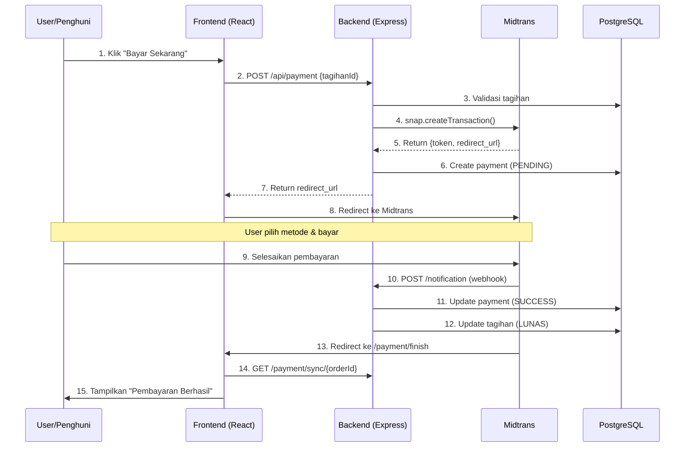

# Payment Flow Documentation

Dokumentasi alur pembayaran dengan integrasi Midtrans yang menjelaskan setiap step dalam proses pembayaran.

---

## Daftar Isi

1. [Halaman Tagihan - Klik Tombol Bayar](#1-halaman-tagihan---klik-tombol-bayar)
2. [Frontend: Memanggil Payment Service](#2-frontend-memanggil-payment-service)
3. [Backend: Membuat Transaksi Midtrans](#3-backend-membuat-transaksi-midtrans)
4. [Redirect ke Midtrans & Pilih Metode Pembayaran](#4-redirect-ke-midtrans--pilih-metode-pembayaran)
5. [User Leave / Menutup Halaman Midtrans](#5-user-leave--menutup-halaman-midtrans)
6. [Kembali ke Halaman Tagihan & Bayar Ulang](#6-kembali-ke-halaman-tagihan--bayar-ulang)
7. [Pembayaran via Midtrans Simulator](#7-pembayaran-via-midtrans-simulator)
8. [Webhook: Midtrans Notifikasi ke Backend](#8-webhook-midtrans-notifikasi-ke-backend)
9. [Halaman Finish & Popup Berhasil](#9-halaman-finish--popup-berhasil)
10. [Status Tagihan Menjadi LUNAS](#10-status-tagihan-menjadi-lunas)

---

## 1. Halaman Tagihan - Klik Tombol Bayar

> **File:** [TagihanDetail.jsx](/frontend/src/pages/tagihan/TagihanDetail.jsx)

Ketika penghuni membuka halaman detail tagihan dan menekan tombol **"Bayar Sekarang"**:

```jsx
// TagihanDetail.jsx - Line 285-291
{!isPemilik && (
    <button
        onClick={handlePayNow}
        className="btn-primary w-full inline-flex items-center justify-center gap-2"
    >
        <HiCreditCard className="w-5 h-5" />
        Bayar Sekarang
    </button>
)}
```

**Penjelasan:**
- Tombol hanya muncul jika user bukan `PEMILIK` dan status tagihan bukan `LUNAS`
- Ketika diklik, akan memanggil function `handlePayNow`

---

## 2. Frontend: Memanggil Payment Service

> **File:** [TagihanDetail.jsx](/frontend/src/pages/tagihan/TagihanDetail.jsx#L40-L68)

Function `handlePayNow` akan memanggil payment service:

```jsx
// TagihanDetail.jsx - Line 40-68
const handlePayNow = async () => {
    try {
        // 1. Panggil API untuk create payment
        const response = await paymentService.create({
            tagihanId: parseInt(id)
        });

        // 2. Redirect ke Midtrans jika ada URL
        if (response.data?.snapRedirectUrl) {
            window.location.href = response.data.snapRedirectUrl;
        } 
        // 3. Atau gunakan Snap popup (alternative)
        else if (response.data?.snapToken) {
            window.snap.pay(response.data.snapToken, {
                onSuccess: () => {
                    toast.success('Pembayaran berhasil!');
                    fetchTagihanById(id);
                },
                onPending: () => toast.info('Menunggu pembayaran...'),
                onError: () => toast.error('Pembayaran gagal'),
                onClose: () => toast.info('Pembayaran dibatalkan')
            });
        }
    } catch (error) {
        toast.error(error.message || 'Gagal memproses pembayaran');
    }
};
```

> **File:** [payment.service.js (Frontend)](/frontend/src/services/payment.service.js#L19-L23)

```javascript
// payment.service.js - Line 21-23
create: async (data) => {
    return api.post('/payment', data);
},
```

---

## 3. Backend: Membuat Transaksi Midtrans

> **File:** [payment.routes.js](/backend/src/routes/payment.routes.js#L18)

Request masuk ke route:

```javascript
// payment.routes.js - Line 18
router.post('/', isAuthenticated, paymentController.createPayment);
```

> **File:** [payment.controller.js](/backend/src/controllers/payment.controller.js#L34-L41)

Controller menerima request:

```javascript
// payment.controller.js - Line 34-41
const createPayment = async (req, res, next) => {
    try {
        const result = await paymentService.createPayment(
            req.body.tagihanId, 
            req.user.id
        );
        return created(res, 'Pembayaran berhasil dibuat', result);
    } catch (error) {
        next(error);
    }
};
```

> **File:** [payment.service.js (Backend)](/backend/src/services/payment.service.js#L64-L149)

Service logic utama untuk create transaksi Midtrans:

```javascript
// payment.service.js - Line 64-149
const createPayment = async (tagihanId, userId) => {
    // 1. Validasi tagihan
    const tagihan = await prisma.tagihan.findUnique({
        where: { id: parsedTagihanId },
        include: { user: true, riwayatSewa: { include: { kamar: true } } }
    });

    if (tagihan.status === 'LUNAS') {
        throw { statusCode: 400, message: 'Tagihan sudah lunas' };
    }

    // 2. Generate kode pembayaran unik
    const kodePembayaran = generateCode('PAY');

    // 3. Create Midtrans transaction parameter
    const parameter = {
        transaction_details: {
            order_id: kodePembayaran,
            gross_amount: parseInt(tagihan.nominal)
        },
        customer_details: {
            first_name: tagihan.user.name,
            email: tagihan.user.email,
            phone: tagihan.user.noTelepon || ''
        },
        item_details: [{
            id: tagihan.nomorTagihan,
            price: parseInt(tagihan.nominal),
            quantity: 1,
            name: `Pembayaran Sewa - ${tagihan.riwayatSewa.kamar.namaKamar}`
        }],
        callbacks: {
            finish: `${process.env.FRONTEND_URL}/payment/finish`
        }
    };

    // 4. Call Midtrans API
    const transaction = await snap.createTransaction(parameter);

    // 5. Simpan payment record ke database
    const payment = await prisma.payment.create({
        data: {
            kodePembayaran,
            tagihanId: tagihan.id,
            userId,
            riwayatSewaId: tagihan.riwayatSewaId,
            grossAmount: tagihan.nominal,
            status: 'PENDING',
            snapToken: transaction.token,
            snapRedirectUrl: transaction.redirect_url
        }
    });

    // 6. Return token dan URL ke frontend
    return {
        payment,
        snapToken: transaction.token,
        redirectUrl: transaction.redirect_url
    };
};
```

---

## 4. Redirect ke Midtrans & Pilih Metode Pembayaran

Setelah backend mengembalikan `snapRedirectUrl`, frontend melakukan redirect:

```javascript
// TagihanDetail.jsx - Line 46-47
if (response.data?.snapRedirectUrl) {
    window.location.href = response.data.snapRedirectUrl;
}
```

**Di halaman Midtrans:**
- User melihat detail pembayaran
- User memilih metode pembayaran (VA Bank, E-Wallet, dll)
- User mendapat instruksi pembayaran

---

## 5. User Leave / Menutup Halaman Midtrans

Ketika user menutup halaman Midtrans tanpa menyelesaikan pembayaran:
- Status payment di database tetap **PENDING**
- Tagihan tetap **BELUM_LUNAS**
- User bisa melanjutkan pembayaran nanti

---

## 6. Kembali ke Halaman Tagihan & Bayar Ulang

> **File:** [TagihanDetail.jsx](/frontend/src/pages/tagihan/TagihanDetail.jsx#L204-L237)

Ketika user kembali ke halaman tagihan, sistem menampilkan riwayat pembayaran sebelumnya:

```jsx
// TagihanDetail.jsx - Line 204-237
{tagihan.payment?.length > 0 && (
    <div className="card">
        <div className="card-header">
            <h3>Riwayat Pembayaran</h3>
        </div>
        <div className="card-body">
            {tagihan.payment.map((payment) => (
                <div key={payment.id} className="flex items-center justify-between">
                    <div>
                        <p>{payment.kodePembayaran}</p>
                        <p>{payment.paymentMethod || payment.paymentGateway}</p>
                    </div>
                    <div className="text-right">
                        <p>{formatRupiah(payment.grossAmount)}</p>
                        <span className={`${payment.status === 'SUCCESS' ? 'text-green-600' : 
                            payment.status === 'PENDING' ? 'text-yellow-600' : 'text-red-600'}`}>
                            {payment.status}
                        </span>
                    </div>
                </div>
            ))}
        </div>
    </div>
)}
```

User masih bisa klik **"Bayar Sekarang"** untuk membuat transaksi baru atau melanjutkan yang pending.

---

## 7. Pembayaran via Midtrans Simulator

User melakukan pembayaran (di sandbox menggunakan simulator):
1. Pilih metode pembayaran (misal: Bank Transfer - BCA)
2. Salin nomor VA
3. Buka simulator Midtrans: `https://simulator.sandbox.midtrans.com/`
4. Pilih "Bank Transfer" → Masukkan nomor VA → Bayar

---

## 8. Webhook: Midtrans Notifikasi ke Backend

> **File:** [payment.routes.js](/backend/src/routes/payment.routes.js#L8)

Midtrans mengirim HTTP POST ke webhook endpoint (tanpa auth):

```javascript
// payment.routes.js - Line 8
router.post('/notification', paymentController.handleNotification);
```

> **File:** [payment.controller.js](/backend/src/controllers/payment.controller.js#L47-L54)

```javascript
// payment.controller.js - Line 47-54
const handleNotification = async (req, res, next) => {
    try {
        const result = await paymentService.handleMidtransNotification(req.body);
        return success(res, result.message);
    } catch (error) {
        next(error);
    }
};
```

> **File:** [payment.service.js (Backend)](/backend/src/services/payment.service.js#L154-L312)

Handle notifikasi dari Midtrans:

```javascript
// payment.service.js - Line 154-312
const handleMidtransNotification = async (notification) => {
    const orderId = notification.order_id;
    const transactionStatus = notification.transaction_status;

    // 1. Cari payment berdasarkan order_id
    const payment = await prisma.payment.findUnique({
        where: { kodePembayaran: orderId },
        include: { user: true, tagihan: true }
    });

    // 2. Tentukan status berdasarkan response Midtrans
    let status = 'PENDING';
    if (transactionStatus === 'capture' || transactionStatus === 'settlement') {
        status = 'SUCCESS';
    } else if (transactionStatus === 'cancel' || transactionStatus === 'deny') {
        status = 'FAILED';
    } else if (transactionStatus === 'expire') {
        status = 'EXPIRED';
    }

    // 3. Jika SUCCESS, update payment dan tagihan
    if (status === 'SUCCESS') {
        await prisma.payment.update({
            where: { id: payment.id },
            data: {
                status: 'SUCCESS',
                paidAt: new Date(),
                transactionId: notification.transaction_id,
                paymentMethod: notification.payment_type,
                paymentGateway: 'Midtrans'
            }
        });

        // UPDATE STATUS TAGIHAN MENJADI LUNAS
        await prisma.tagihan.update({
            where: { id: payment.tagihanId },
            data: { status: 'LUNAS' }
        });

        // Kirim email notifikasi
        await sendPaymentNotification(payment.user.email, {...});
    }

    return { message: 'Notification processed' };
};
```

---

## 9. Halaman Finish & Popup Berhasil

> **File:** [PaymentFinish.jsx](/frontend/src/pages/payment/PaymentFinish.jsx)

Setelah pembayaran, Midtrans redirect user ke `/payment/finish`:

```jsx
// PaymentFinish.jsx - Line 6-94
const PaymentFinish = () => {
    const [searchParams] = useSearchParams();
    const [syncResult, setSyncResult] = useState(null);
    
    const orderId = searchParams.get('order_id');

    // Sync status dengan backend saat halaman load
    useEffect(() => {
        const syncPayment = async () => {
            try {
                const response = await paymentService.syncStatus(orderId);
                setSyncResult({
                    success: response.data?.midtransStatus === 'settlement',
                    status: response.data?.midtransStatus // 'settlement' = berhasil
                });
            } catch (error) {
                console.error('Failed to sync payment:', error);
            }
        };
        syncPayment();
    }, [orderId]);

    // Tampilkan UI berdasarkan status
    const statusConfig = {
        settlement: { 
            icon: HiCheckCircle, 
            color: 'text-green-600', 
            text: 'Pembayaran Berhasil!',
            desc: 'Terima kasih! Pembayaran Anda telah diterima.'
        },
        pending: {...},
        deny: {...},
        // ...
    };

    return (
        <div className="card">
            <Icon className={config.color} /> {/* Centang hijau */}
            <h2>{config.text}</h2>  {/* "Pembayaran Berhasil!" */}
            <p>{config.desc}</p>
            <Link to="/tagihan">Lihat Tagihan</Link>
        </div>
    );
};
```

---

## 10. Status Tagihan Menjadi LUNAS

> **File:** [payment.service.js (Backend)](/backend/src/services/payment.service.js#L203-L206)

Status tagihan diupdate saat webhook diterima:

```javascript
// payment.service.js - Line 203-206
await prisma.tagihan.update({
    where: { id: payment.tagihanId },
    data: { status: 'LUNAS' }  // <-- Status berubah!
});
```

Di frontend, badge status akan berubah:

```jsx
// TagihanDetail.jsx - Line 253-278
<div className={`p-4 rounded-lg ${
    tagihan.status === 'LUNAS' ? 'bg-green-50 border-green-200' : ...
}`}>
    <p className="text-green-800">
        {TAGIHAN_STATUS_LABELS[tagihan.status]} {/* "Lunas" */}
    </p>
    <p className="text-green-600">
        Tagihan sudah dibayar
    </p>
</div>
```

---

## Flow Diagram



---

## File Reference

| Step | File | Line |
|------|------|------|
| Tombol Bayar | [TagihanDetail.jsx](/frontend/src/pages/tagihan/TagihanDetail.jsx#L285-L291) | 285-291 |
| handlePayNow | [TagihanDetail.jsx](/frontend/src/pages/tagihan/TagihanDetail.jsx#L40-L68) | 40-68 |
| Payment Service (FE) | [payment.service.js](/frontend/src/services/payment.service.js#L21-L23) | 21-23 |
| Route Definition | [payment.routes.js](/backend/src/routes/payment.routes.js#L18) | 18 |
| Controller | [payment.controller.js](/backend/src/controllers/payment.controller.js#L34-L41) | 34-41 |
| Create Payment | [payment.service.js](/backend/src/services/payment.service.js#L64-L149) | 64-149 |
| Webhook Handler | [payment.service.js](/backend/src/services/payment.service.js#L154-L312) | 154-312 |
| Update to LUNAS | [payment.service.js](/backend/src/services/payment.service.js#L203-L206) | 203-206 |
| Finish Page | [PaymentFinish.jsx](/frontend/src/pages/payment/PaymentFinish.jsx) | All |
