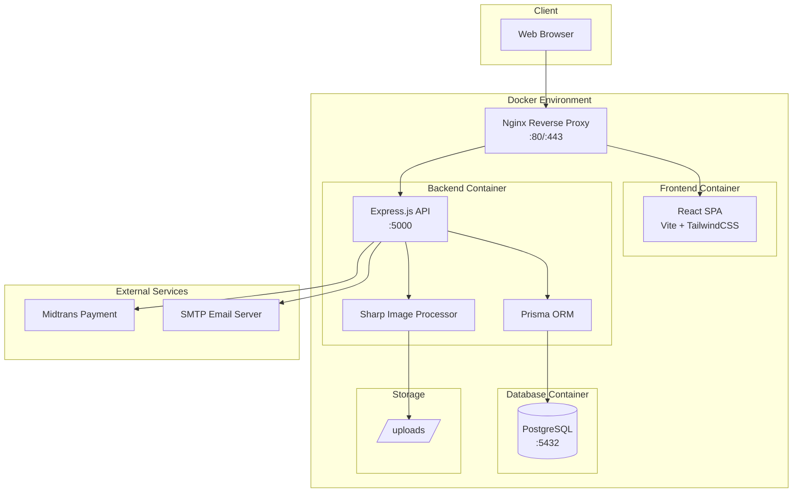
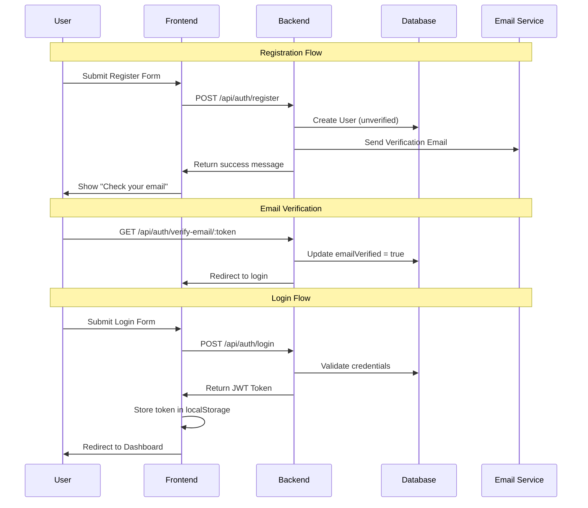
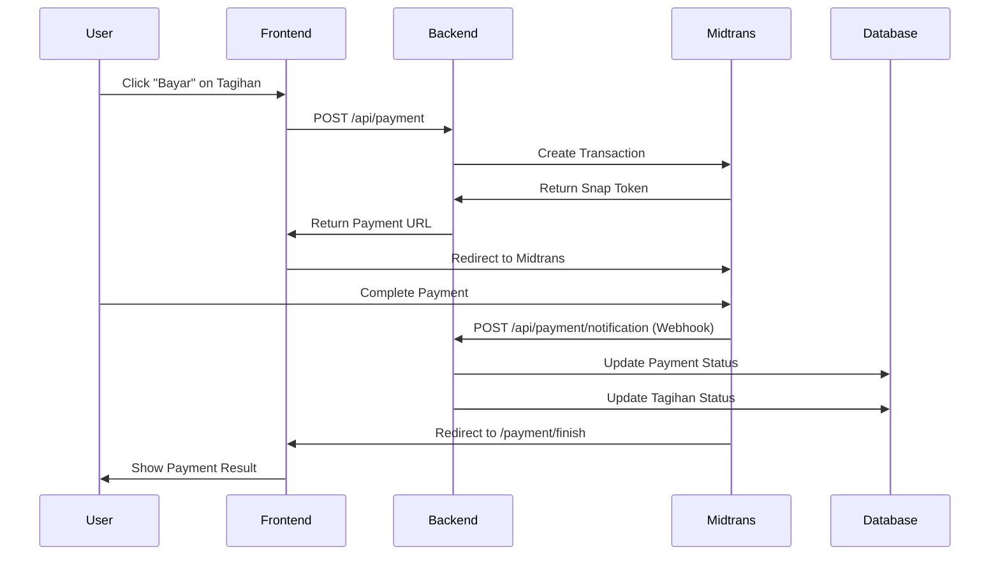
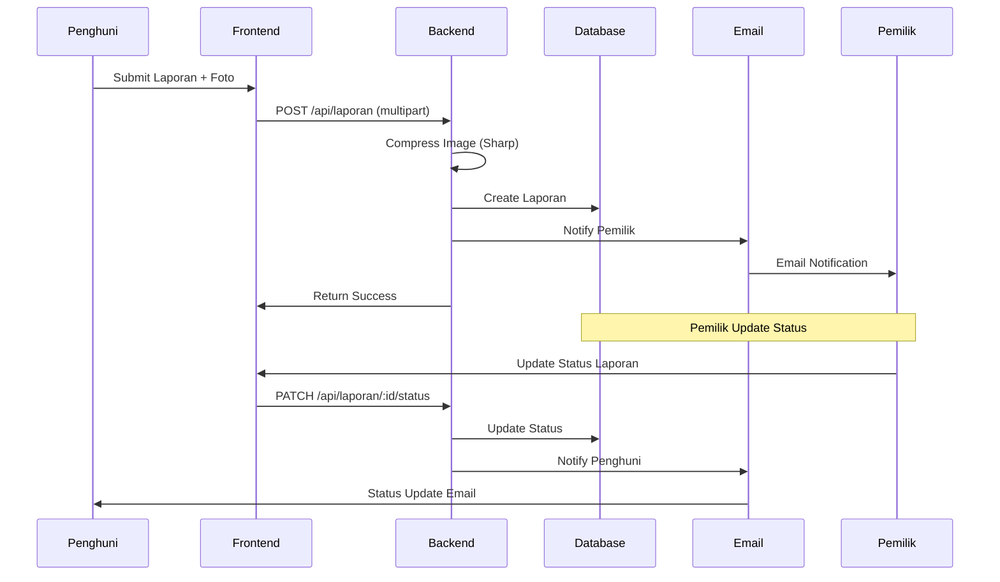
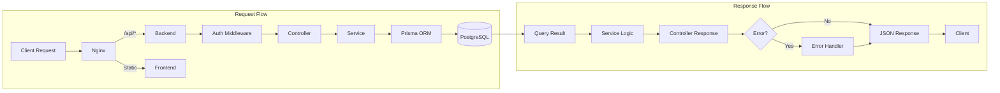

# System Workflow - Sistem Manajemen Kos

Dokumentasi ini menjelaskan alur kerja sistem secara keseluruhan, termasuk arsitektur, flow data, dan integrasi antar komponen.

## Arsitektur Sistem



## Flow Utama Aplikasi

### 1. Authentication Flow



### 2. Payment Flow (Midtrans)



### 3. Laporan Kerusakan Flow



## Role-Based Access Control

### User Roles

| Role | Kode | Deskripsi |
|------|------|-----------|
| **Pemilik** | `PEMILIK` | Administrator/pemilik kos dengan full akses |
| **Penghuni** | `PENGHUNI` | Penyewa kamar dengan akses terbatas |

### Access Matrix

| Fitur | Pemilik | Penghuni |
|-------|:-------:|:--------:|
| Dashboard Analytics | yes | yes (limited) |
| Kelola Kamar | yes CRUD | no |
| Kelola Penghuni | yes CRUD | no |
| Lihat Tagihan | yes All | yes Own only |
| Generate Tagihan | yes | no |
| Bayar Tagihan | no | yes |
| Buat Laporan | no | yes |
| Proses Laporan | yes | no |
| Kelola Inventori | yes | yes (kamar sendiri) |
| Kelola Barang Master | yes | no |

## Struktur Folder Project

```
sistemManagemenKos/
├── backend/                    # Express.js Backend API
│   ├── prisma/                 # Prisma Schema & Migrations
│   │   ├── schema.prisma       # Database schema definition
│   │   ├── migrations/         # Database migrations
│   │   └── seed.js             # Data seeding
│   ├── src/
│   │   ├── config/             # App configuration
│   │   ├── controllers/        # Route handlers (11 controllers)
│   │   ├── services/           # Business logic (8 services)
│   │   ├── middlewares/        # Auth, upload, validation (5)
│   │   ├── routes/             # API routes (8 route files)
│   │   ├── models/             # Prisma client singleton
│   │   ├── utils/              # Email, logger, compression
│   │   └── validations/        # Input validation schemas
│   ├── uploads/                # Uploaded files storage
│   ├── Dockerfile              # Backend container config
│   └── package.json
│
├── frontend/                   # React.js SPA
│   ├── src/
│   │   ├── components/         # Reusable UI components
│   │   │   ├── common/         # Button, Card, Modal, etc.
│   │   │   ├── forms/          # Form components
│   │   │   └── layout/         # Navbar, Sidebar, Layout
│   │   ├── pages/              # Page components (9 sections)
│   │   ├── features/           # Zustand stores (7 stores)
│   │   ├── services/           # API service modules (8)
│   │   ├── hooks/              # Custom React hooks
│   │   ├── routes/             # Route definitions
│   │   └── utils/              # Helper functions
│   ├── Dockerfile              # Frontend container config
│   ├── nginx.conf              # Frontend nginx config
│   └── package.json
│
├── docker/                     # Docker configurations
│   ├── nginx/                  # Reverse proxy setup
│   │   ├── Dockerfile
│   │   ├── nginx.conf
│   │   └── ssl/                # SSL certificates
│   └── postgres/
│       └── init.sql
│
├── docs/                       # Documentation
│   ├── SYSTEM_WORKFLOW.md      # This file
│   ├── FRONTEND.md             # Frontend documentation
│   ├── BACKEND.md              # Backend documentation
│   └── DEPLOYMENT.md           # Deployment guide
│
├── docker-compose.yml          # Base Docker config
├── docker-compose.dev.yml      # Development overrides
├── docker-compose.prod.yml     # Production overrides
├── .env                        # Environment variables
└── README.md                   # Project overview
```

## API Endpoint Overview

### Base URL
- Development: `http://localhost:5000/api`
- Production (via Nginx): `http://localhost/api` atau `https://yourdomain.com/api`

### Endpoint Groups

| Prefix | Deskripsi | Auth Required |
|--------|-----------|:-------------:|
| `/api/auth/*` | Authentication (login, register, verify) | no/yes |
| `/api/users/*` | User management | yes |
| `/api/kamar/*` | Room management | yes |
| `/api/barang/*` | Item/inventory management | yes |
| `/api/tagihan/*` | Invoice management | yes |
| `/api/payment/*` | Payment processing | yes/no |
| `/api/laporan/*` | Damage report management | yes |

## Teknologi Stack

### Backend Stack

| Komponen | Teknologi | Versi |
|----------|-----------|-------|
| Runtime | Node.js | 18+ |
| Framework | Express.js | 4.18 |
| ORM | Prisma | 5.7 |
| Database | PostgreSQL | 15+ |
| Auth | JWT (jsonwebtoken) | 9.0 |
| Validation | Zod, express-validator | - |
| Security | Helmet, CORS, bcryptjs | - |
| File Upload | Multer + Sharp | - |
| Email | Nodemailer | 6.9 |
| Payment | Midtrans Client | 1.3 |
| Logging | Winston + Morgan | - |

### Frontend Stack

| Komponen | Teknologi | Versi |
|----------|-----------|-------|
| Library | React | 18.2 |
| Build Tool | Vite | 5.0 |
| Styling | TailwindCSS | 3.4 |
| State Management | Zustand | 4.4 |
| Routing | React Router DOM | 6.21 |
| HTTP Client | Axios | 1.6 |
| Forms | React Hook Form | 7.49 |
| Icons | React Icons | 5.0 |
| Date Utils | date-fns | 3.0 |
| Notifications | React Hot Toast | 2.4 |

### DevOps Stack

| Komponen | Teknologi |
|----------|-----------|
| Containerization | Docker |
| Orchestration | Docker Compose |
| Reverse Proxy | Nginx |
| Process Manager | Docker (restart: unless-stopped) |

## Request/Response Cycle



## Notification System

### Email Templates

| Event | Recipient | Content |
|-------|-----------|---------|
| User Registration | User | Verification link |
| Forgot Password | User | Reset password link |
| Payment Success | Penghuni | Payment confirmation |
| New Laporan | Pemilik | New damage report notification |
| Laporan Status Update | Penghuni | Status change notification |

### Notification Triggers

```javascript
// Server-side events that trigger notifications
- User.create() → Email verification
- User.forgotPassword() → Reset password email
- Payment.success() → Payment confirmation
- Laporan.create() → Notify pemilik
- Laporan.updateStatus() → Notify penghuni
```

## File Upload & Processing

### Supported Upload Types

| Context | Field Name | Max Size | Allowed Types |
|---------|------------|----------|---------------|
| Profile Photo | `foto` | 5MB | jpg, jpeg, png |
| Room Photo | `foto` | 5MB (50MB total) | jpg, jpeg, png |
| Report Photo | `foto` | 5MB | jpg, jpeg, png |
| Payment Proof | `buktiPembayaran` | 5MB | jpg, jpeg, png |

### Image Processing Pipeline

```
Upload → Multer → Sharp Processing → Storage
                       ↓
              - Resize (max 1920x1080)
              - Convert to WebP
              - Compress (80% quality)
              - Save compressed file
              - Delete original
```

## Security Measures

| Layer | Measure | Implementation |
|-------|---------|----------------|
| Network | CORS | Origin whitelist |
| Headers | Helmet | Security headers |
| Auth | JWT | Token-based authentication |
| Password | bcrypt | Hashed with salt |
| Input | Zod/Validator | Schema validation |
| File | Multer | Type & size validation |
| SQL | Prisma | Parameterized queries |
| API | Rate Limit | Nginx level (configurable) |

